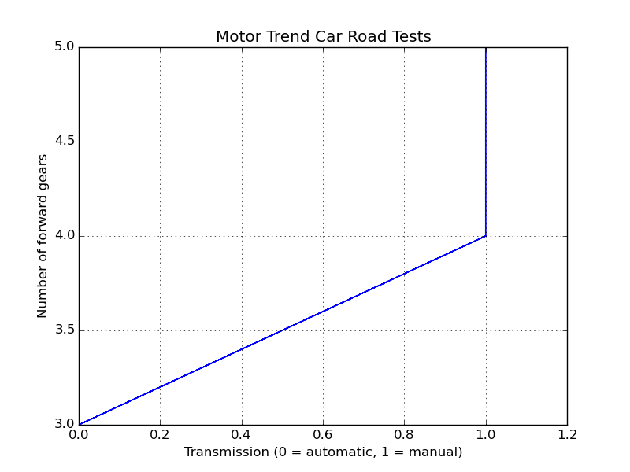

# Python Implementation Pattern

Simple line Chart is type of graph showing a line ascending and / or descending, line chart regularly shows the tendency of a data set against other data (regularly) against a time interval.

## Data Set

For this example it will be used Data Set called mtcars, this data set is the R default data set, to use this data set, was used a Python module called rpy2, which is used to use data sets of R in python. This data was extracted from the 1974 Motor Trend US magazine, and comprises fuel consumption and 10 aspects of automobile design and performance for 32 automobiles (1973–74 models).

## Dependencies 

list of Modules that are required for implementation
> Matplotlib
> Seaborn

## Code example 

### Code Example With Matplotlib

~~~~{.python}
import matplotlib.pyplot as plt
from datos import data

d=data('mtcars')
t =d.am
s =d.gear
plt.xlim(0,1.2)
plt.plot(t,s)
plt.xlabel('Transmission (0 = automatic, 1 = manual)')
plt.ylabel('Number of forward gears')
plt.title('Motor Trend Car Road Tests')
plt.grid(True)
plt.show()
~~~~~~~~~~~~~

### Code Example With Seaborn

~~~~{.python}
import matplotlib.pyplot as plt
import seaborn as sns
from datos import data

d=data('mtcars')
t =d.am
s =d.gear
sns.set_style("whitegrid")
plt.plot(t,s)
plt.xlabel('Transmission (0 = automatic, 1 = manual)')
plt.ylabel('Number of forward gears')
plt.title('Motor Trend Car Road Tests')
plt.show()
~~~~~~~~~~~~~

### Code Example With PyQtGraph 

~~~~{.python}
from pyqtgraph.Qt import QtGui, QtCore
import pyqtgraph as pg
from datos import data
d=data("mtcars")

app = QtGui.QApplication([])
view = pg.GraphicsView()
l = pg.GraphicsLayout(border=(100,100,100))
view.setCentralItem(l)
view.show()
view.setWindowTitle('Simple Line Chart Example')
view.resize(800,600)

p1 = l.addPlot(title="Motor Trend Car Road Tests")
p1.plot(d.am,d.gear)

if __name__ == '__main__':
    import sys
    if (sys.flags.interactive != 1) or not hasattr(QtCore,
'PYQT_VERSION'):
        QtGui.QApplication.instance().exec_()
~~~~~~~~~~~~~

