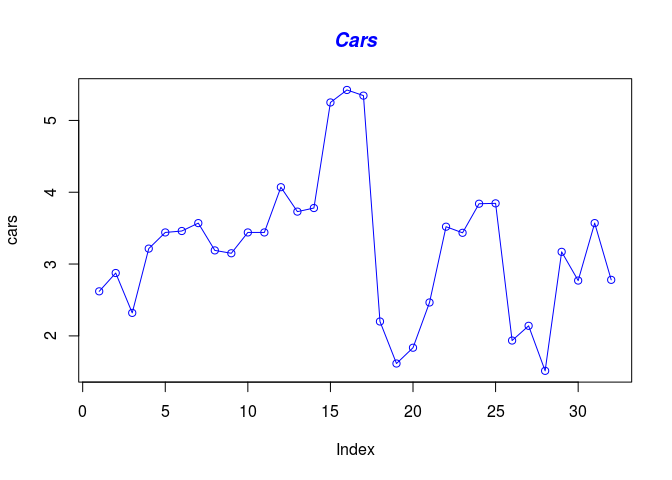
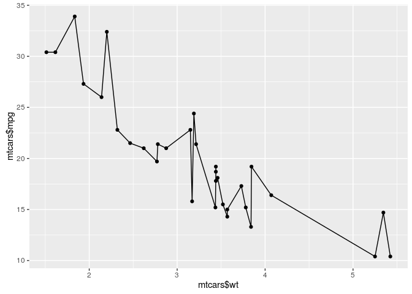
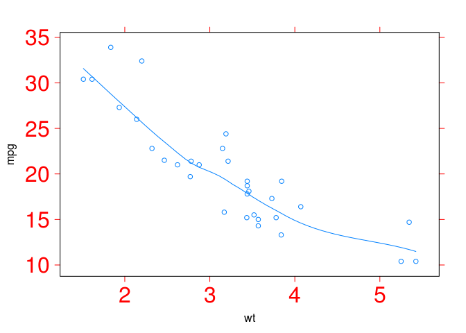

R Implementation Pattern
========================

Simple Line Chart pattern is very easy to implement on R, insomuch as R
have a package called graphics in which can to make simple line chart,
package graphics is recomended but there are more packages that are not
default on R that can be implemented to make Simple Line Chart Pattern.

Then it shows an example of R pattern implementation.

Data Set
--------

For this example it will be used Data Set called mtcars, this data set
is the R default data set this data was extracted from the 1974 Motor
Trend US magazine, and comprises fuel consumption and 10 aspects of
automobile design and performance for 32 automobiles (1973–74 models).

    head(mtcars)

    ##                    mpg cyl disp  hp drat    wt  qsec vs am gear carb
    ## Mazda RX4         21.0   6  160 110 3.90 2.620 16.46  0  1    4    4
    ## Mazda RX4 Wag     21.0   6  160 110 3.90 2.875 17.02  0  1    4    4
    ## Datsun 710        22.8   4  108  93 3.85 2.320 18.61  1  1    4    1
    ## Hornet 4 Drive    21.4   6  258 110 3.08 3.215 19.44  1  0    3    1
    ## Hornet Sportabout 18.7   8  360 175 3.15 3.440 17.02  0  0    3    2
    ## Valiant           18.1   6  225 105 2.76 3.460 20.22  1  0    3    1

Dependencies
------------

Graphics - default package on R Ggplot2 Lattice \#\# Code example

### Code Example With Graphics

    cars <- (mtcars$wt)
    plot(cars, type="o", col="blue")
    title(main="Cars", col.main="blue", font.main=4)

<!-- -->
\#\#\# Code Example With Ggplot

    head(mtcars)

    ##                    mpg cyl disp  hp drat    wt  qsec vs am gear carb
    ## Mazda RX4         21.0   6  160 110 3.90 2.620 16.46  0  1    4    4
    ## Mazda RX4 Wag     21.0   6  160 110 3.90 2.875 17.02  0  1    4    4
    ## Datsun 710        22.8   4  108  93 3.85 2.320 18.61  1  1    4    1
    ## Hornet 4 Drive    21.4   6  258 110 3.08 3.215 19.44  1  0    3    1
    ## Hornet Sportabout 18.7   8  360 175 3.15 3.440 17.02  0  0    3    2
    ## Valiant           18.1   6  225 105 2.76 3.460 20.22  1  0    3    1

    library(ggplot2)
    ggplot(data=mtcars, aes(x=mtcars$wt, y=mtcars$mpg))+
      geom_line()+
      geom_point()

<!-- -->
\#\#\# Code Example With Graphics

    library(lattice)
    panel.spline <- function(x, y) {
      panel.xyplot(x, y) 
      panel.loess(x, y) 
    }
    attach(mtcars)

    ## The following object is masked from package:ggplot2:
    ## 
    ##     mpg

    xyplot(mpg~wt, scales=list(cex=2, col="red"),
           panel=panel.spline)

<!-- -->
