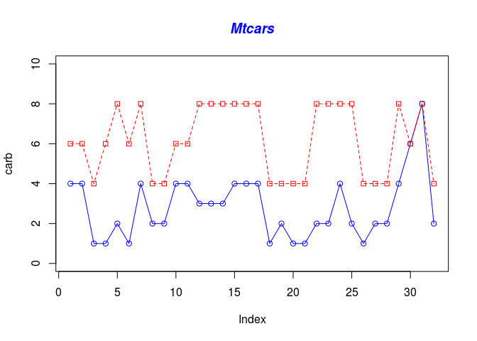
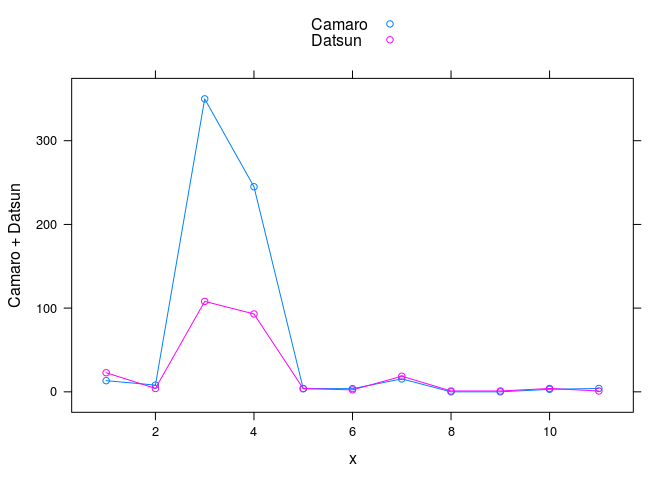

R Implementation Pattern
========================

implementacion del patron en R

Data Set
--------

For this example it will be used Data Set called mtcars, this data set
is the R default data set this data was extracted from the 1974 Motor
Trend US magazine, and comprises fuel consumption and 10 aspects of
automobile design and performance for 32 automobiles (1973–74 models).

    head(mtcars)

    ##                    mpg cyl disp  hp drat    wt  qsec vs am gear carb
    ## Mazda RX4         21.0   6  160 110 3.90 2.620 16.46  0  1    4    4
    ## Mazda RX4 Wag     21.0   6  160 110 3.90 2.875 17.02  0  1    4    4
    ## Datsun 710        22.8   4  108  93 3.85 2.320 18.61  1  1    4    1
    ## Hornet 4 Drive    21.4   6  258 110 3.08 3.215 19.44  1  0    3    1
    ## Hornet Sportabout 18.7   8  360 175 3.15 3.440 17.02  0  0    3    2
    ## Valiant           18.1   6  225 105 2.76 3.460 20.22  1  0    3    1

Dependencies
------------

> Graphics - default package on R Ggplot2 Lattice

Code example
------------

### Code Example With Graphics

    carb <- mtcars$carb
    cyl <- mtcars$cyl

    plot(carb, type="o", col="blue", ylim=c(0,10))

    lines(cyl, type="o", pch=22, lty=2, col="red")

    title(main="Mtcars", col.main="Blue", font.main=4)

<!-- -->
\#\#\# Code Example With Ggplot

    library(ggplot2)

    df2 <- mtcars
    ggplot(data=df2, aes(x=mpg, y=hp, group=gear)) +
      geom_line()+
      geom_point()

<!-- -->
\#\#\# Code Example With Lattice

    library(lattice)
    L = mtcars$am == 0 
    Camaro=mtcars["Camaro Z28",]
    Datsun=mtcars["Datsun 710",]
    x= 1:11
    df <- data.frame(Camaro = Camaro, Datsun = Datsun, x = x)

    ## Warning in data.frame(Camaro = Camaro, Datsun = Datsun, x = x): row names
    ## were found from a short variable and have been discarded

    xyplot(Camaro + Datsun  ~ x, data = df, type = "o", auto.key=TRUE)

<!-- -->
