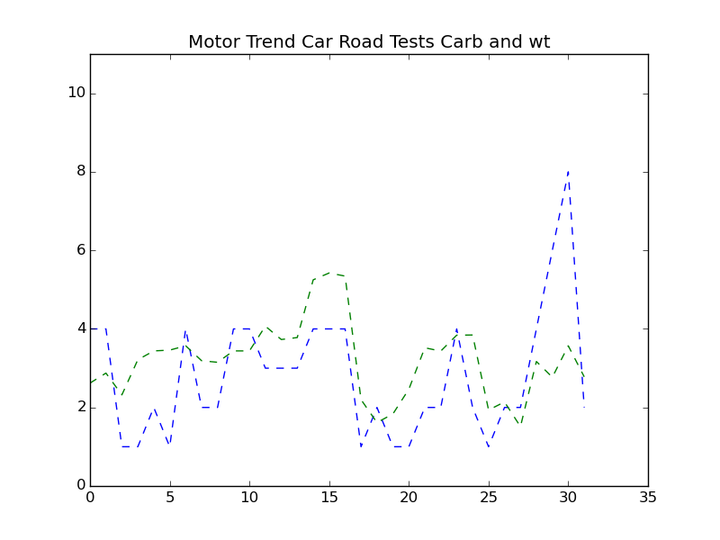
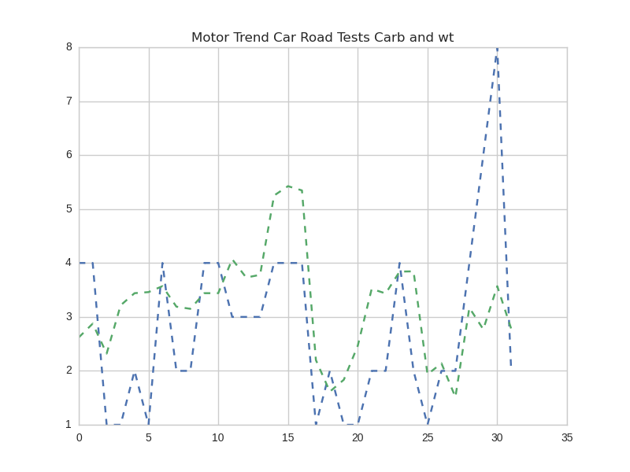
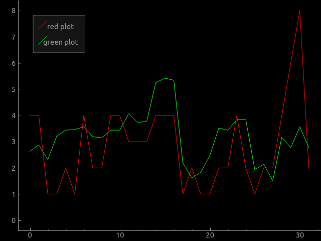

# Python Implementation Pattern

A multiple line chart is a graphic in which show multiple data series and allows a more graphic visual comparison between the different data groups. 

## Data Set

For this example it will be used Data Set called mtcars, this data set is the R default data set, to use this data set, was used a Python module called rpy2, which is used to use data sets of R in python. This data was extracted from the 1974 Motor Trend US magazine, and comprises fuel consumption and 10 aspects of automobile design and performance for 32 automobiles (1973–74 models).

## Dependencies 

list of Modules that are required for implementation
> Matplotlib
> Seaborn
> PyQtGraph

## Code example 

### Code Example With Matplotlib

~~~~{.python}

from datos import data
import matplotlib.pyplot as plt

d=data('mtcars')

carb=d.carb
wt= d.wt

plt.ylim(0,11)
plt.title('Motor Trend Car Road Tests Carb and wt')
plt.plot(carb , '--',wt, '--')
plt.show()
~~~~~~~~~~~~~

\

### Code Example With Seaborn

~~~~{.python}

import matplotlib.pyplot as plt
import seaborn as sns
from datos import data

d=data('mtcars')
t=d.carb
s= d.wt

sns.set_style("whitegrid")
plt.plot(t,'--',s,'--')
plt.title('Motor Trend Car Road Tests Carb and wt')
plt.show()
~~~~~~~~~~~~~

\

### Code Example With PyQtGraph 

~~~~{.python}

import pyqtgraph as pg
from pyqtgraph.Qt import QtCore, QtGui
from datos import data

d=data('mtcars')
t=d.carb
s= d.wt

plt = pg.plot()
plt.setWindowTitle('pyqtgraph example: Legend')
plt.addLegend()

c1 = plt.plot(t, pen='r',name='red plot')
c2 = plt.plot(s, pen='g', fillLevel=0, name='green plot')

if __name__ == '__main__':
    import sys
    if (sys.flags.interactive != 1) or not hasattr(QtCore,
'PYQT_VERSION'):
        QtGui.QApplication.instance().exec_()
~~~~~~~~~~~~~

