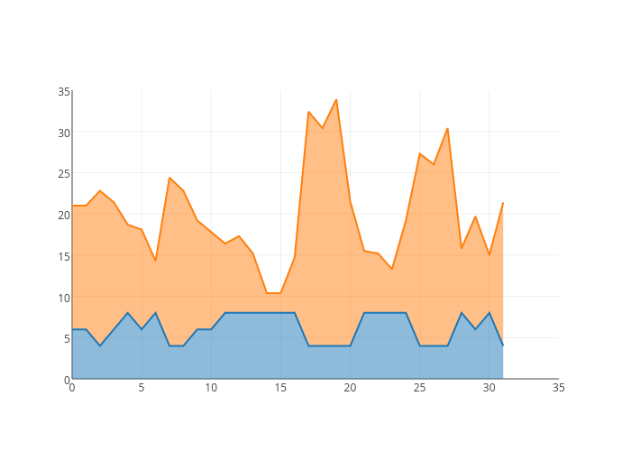
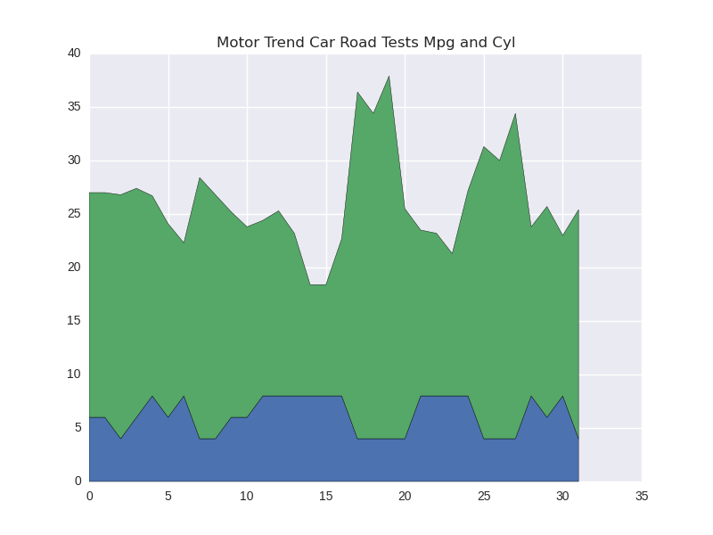

# Python Implementation Pattern

like charts Simple Line Chart, charts Stacked Area show a line graph with the area painted increase, this area allows you to view a mirrored by completing a total area colored advance, this kind of graphs can show commonly two or more comparisons on a graph 

## Data Set

For this example it will be used Data Set called mtcars, this data set is the R default data set, to use this data set, was used a Python module called rpy2, which is used to use data sets of R in python. This data was extracted from the 1974 Motor Trend US magazine, and comprises fuel consumption and 10 aspects of automobile design and performance for 32 automobiles (1973–74 models).

## Dependencies 

list of Modules that are required for implementation
> Matplotlib
>> Plotly 
Plotly for Python an R is an interactive, browser-based charting library built on the open source JavaScript graphing library, plotly.js. It works entirely locally, through the HTML widgets framework. To use this depndence you nedd to have a plotly account. [https://plot.ly/python/]

> Seaborn

## Code example 

### Code Example With Matplotlib and Plotly

This example show a graph  between  mpg(miles per gallon) and Cyl(Cylinders) from data set Mtcars
The orange area belongs to data Mpg and blue area belongs to data Cyl

~~~~{.python}

import numpy as np
import matplotlib.pyplot as plt
import plotly.plotly as py
from datos import data

d=data('mtcars')
carb=d.cyl
wt= d.mpg
y0 = carb
y1 = wt

fig, ax = plt.subplots()
ax.plot(y0, label='y0')
ax.plot(y1, label='y1')

update = {'data':[{'fill': 'tonexty'}]}
plot_url = py.plot_mpl(fig, update=update, strip_style=True, filename
='mpl-stacked-line')
~~~~~~~~~~~~~

### Code Example With Seaborn

~~~~{.python}

import matplotlib.pyplot as plt
import seaborn as sns
from datos import data
import numpy as np

d=data('mtcars')
c=d.cyl
m=d.mpg

y = np.row_stack((c,m))
x = np.arange(32)

y1, y2 = c, m

fig, ax = plt.subplots()
ax.stackplot(x, y1, y2)
sns.set_style("whitegrid")
plt.title('Motor Trend Car Road Tests Carb and wt')
plt.show()
~~~~~~~~~~~~~

