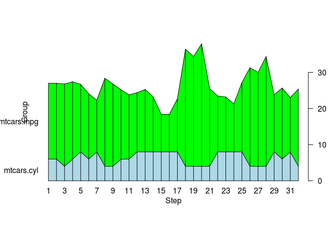
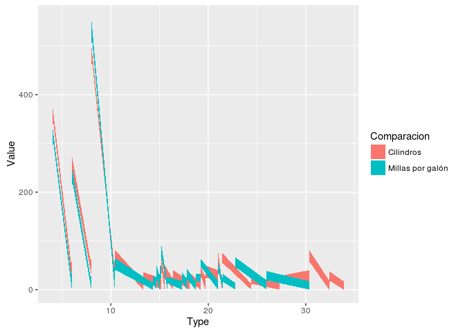

R Implementation Pattern
========================

like charts Simple Line Chart, charts Stacked Area show a line graph 
with the area painted increase, this area allows you to view a 
mirrored by completing a total area colored advance, this kind of 
graphs can show commonly two or more comparisons on a graph.

Data Set
--------

For this example it will be used Data Set called mtcars, this data set
is the R default data set this data was extracted from the 1974 Motor
Trend US magazine, and comprises fuel consumption and 10 aspects of
automobile design and performance for 32 automobiles (1973–74 models).

    head(mtcars)

    ##                    mpg cyl disp  hp drat    wt  qsec vs am gear carb
    ## Mazda RX4         21.0   6  160 110 3.90 2.620 16.46  0  1    4    4
    ## Mazda RX4 Wag     21.0   6  160 110 3.90 2.875 17.02  0  1    4    4
    ## Datsun 710        22.8   4  108  93 3.85 2.320 18.61  1  1    4    1
    ## Hornet 4 Drive    21.4   6  258 110 3.08 3.215 19.44  1  0    3    1
    ## Hornet Sportabout 18.7   8  360 175 3.15 3.440 17.02  0  0    3    2
    ## Valiant           18.1   6  225 105 2.76 3.460 20.22  1  0    3    1

Dependencies
------------

> Graphics - default package on R

For this example in graphics it will be used other dependence called
plot\_area.R this dependence is hosted in this link:
\[<https://gist.github.com/fawda123/6589541/raw/8de8b1f26c7904ad5b32d56ce0902e1d93b89420/plot_area.r>\]

> Ggplot2

Code example
------------

### Code Example With Graphics

    source('Continuous Quantities/plot_area.r')
    datos<-data.frame(mtcars$cyl,mtcars$mpg)
    plot.area(datos,prop=F,horiz=T)

### Code Example With Ggplot2

    library(ggplot2)
    data.set <- data.frame(
      Type = c(rep(mtcars$mpg, 2),rep(mtcars$cyl, 2)),
      Comparacion = rep(c('Millas por galón', 'Cilindros'), 2),
      Value = rpois(32, 20)
    )

    qplot(Type, Value, data = data.set, fill = Comparacion, geom = "area")

