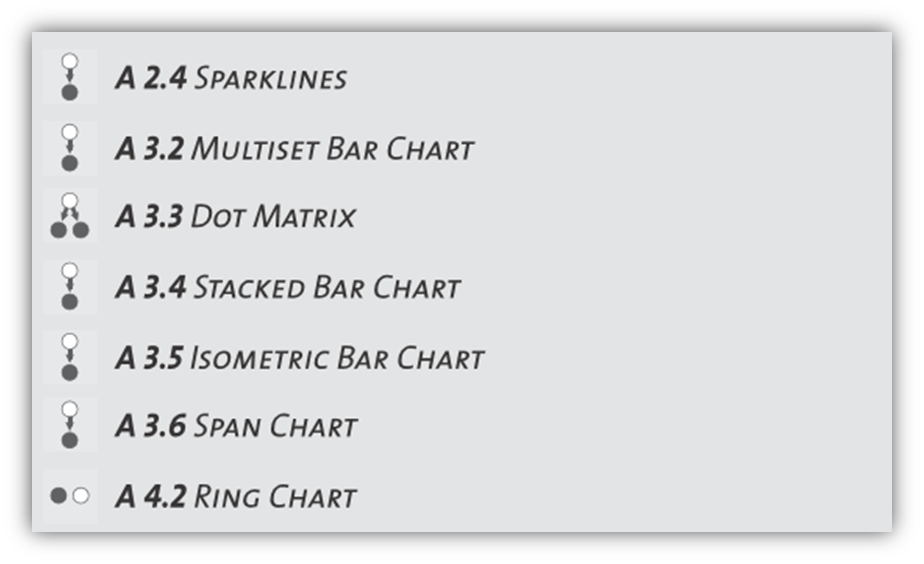

#A 3.1: SIMPLE BAR CHART

## Description

Bar charts are used to visualize ab- solute magnitudes of nominal data items. They can theoretically consist only a single data item, but in most cases are used to additionally compare the quantitative value of several entities with each other. Bar charts as a major group of standard dis- play are distinguished charts from line charts and pie charts as they do not display continuos devel- opments over an interval but measure the values of discrete data items. Also, they display absolute numerical values rather than proportions (Behrens, 2008).

## Required Data

The data you want to display is a set of quantitative values, while each data item represents a unique discrete entity that is clearly identifable. All data items are measured on the same scale so that their numeric values can be di- rectly compared to each other (Behrens, 2008).

## Usage

Create a Cartesian coordinate system. Divide and label the y-axis so that the magnitude of each item lies within the available scale. Separate the x-axis into regular segments, and attach to each of these segments one of the data items you want to display. For each data item, attach a verti- cal rectangle above the corresponding label on the x-axis and adjust its height according to the data value it represents (Behrens, 2008).

## Rationale

Bar charts are, besides line and pie a 4.2 charts the most common data visualization tech- nique and fnd wide usage in popular statistics. They are useful to compare several quantitative en tities of a common class. The substantial informa tion provided by a bar chart is the relationship of several data items belonging to a common group or class in terms of magnitude (Behrens, 2008).

## Related Patterns

