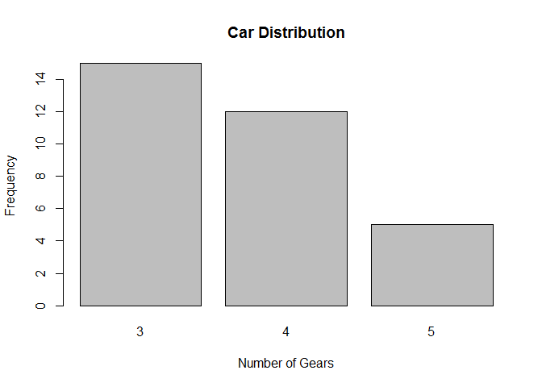
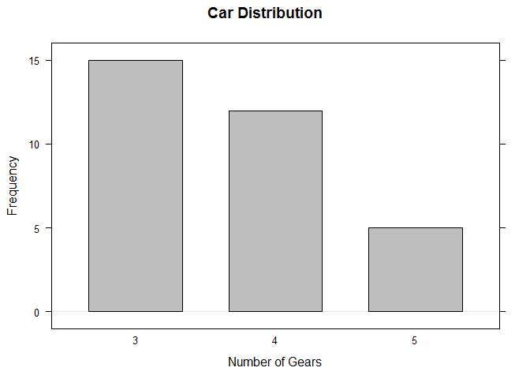
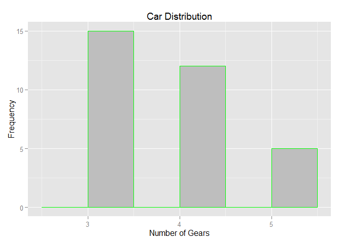

R IMPLEMENTATION
================

Data Set
--------

    table(mtcars$gear)

    ## 
    ##  3  4  5 
    ## 15 12  5

Dependences
-----------

-   lattice
-   ggplot2

Code Example
------------

### Graphics

    counts <- table(mtcars$gear)
    barplot(counts, main="Car Distribution", xlab="Number of Gears", ylab="Frequency", col="grey")

<!-- -->

### Lattice

    library("lattice")
    counts <- table(mtcars$gear)
    barchart(counts, main="Car Distribution", xlab="Number of Gears",ylab="Frequency", horizontal="false", col="grey")

<!-- -->

### ggplot2

    library("ggplot2")
    g <- ggplot(mtcars, aes(gear)) + geom_bar(fill = "gray", colour = "green", , binwidth = 0.5)
    g + labs(list(title = "Car Distribution", x="Number of Gears", y="Frequency"))

<!-- -->

References
----------
