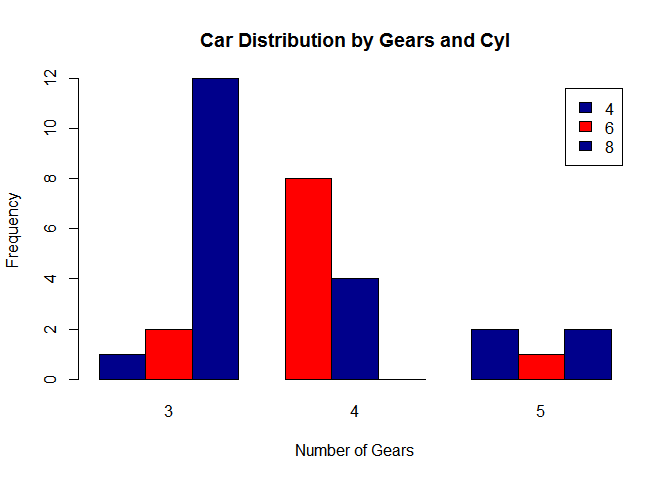
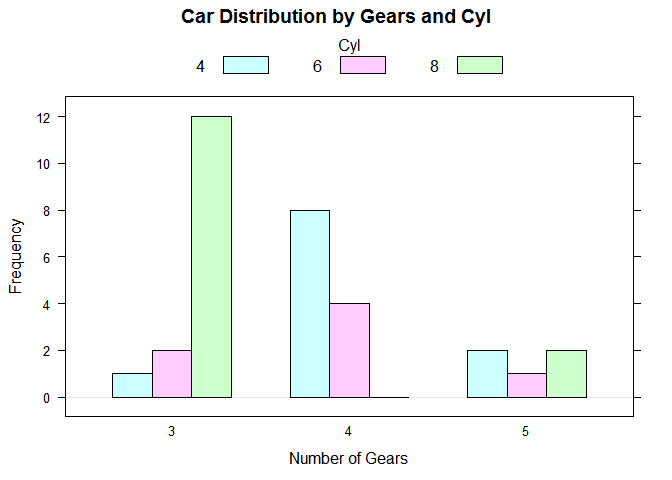
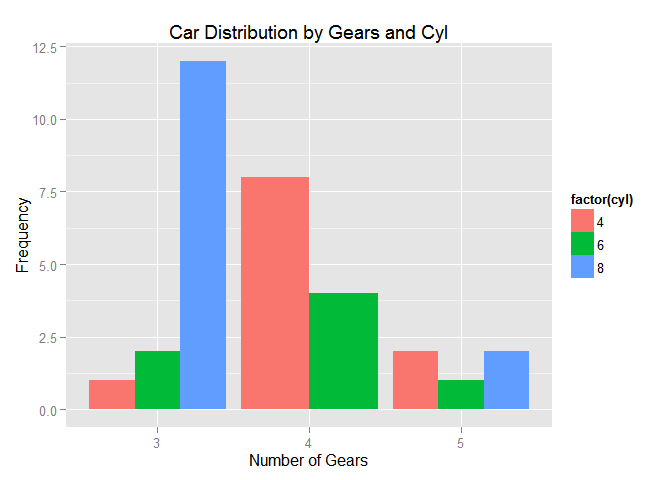

R IMPLEMENTATION
================

Data Set
--------

    counts <- table(mtcars$cyl, mtcars$gear)
    counts

    ##    
    ##      3  4  5
    ##   4  1  8  2
    ##   6  2  4  1
    ##   8 12  0  2

Dependences
-----------

-   lattice
-   ggplot2

Code Example
------------

### Graphics

    counts <- table(mtcars$cyl, mtcars$gear)
    barplot(counts, main="Car Distribution by Gears and Cyl",
      xlab="Number of Gears", ylab="Frequency", col=c("darkblue","red"),
        legend = rownames(counts), beside=TRUE)

<!-- -->

### Lattice

    library("lattice")
    counts <- table(mtcars$gear, mtcars$cyl)
    barchart(counts, stack = FALSE, horizontal="false", main="Car Distribution by Gears and Cyl",     xlab="Number of Gears", ylab="Frequency",
             auto.key = list(space="top", columns=3, title="Cyl", cex.title=1))

<!-- -->

### ggplot2

    library("ggplot2")

    ## Warning: package 'ggplot2' was built under R version 3.2.2

    g <- ggplot(mtcars, aes(factor(gear), fill=factor(cyl))) + geom_bar( position = "dodge")
    g + labs(list(title = "Car Distribution by Gears and Cyl", x="Number of Gears", y="Frequency"))

<!-- -->

References
----------
