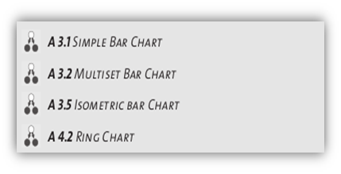

#A 3.3: DOT MATRIX

## Description

The dot matrix is a one-dimensional representation form for discrete quantitative data.
Instead of merging the discrete values into a continuous representation such as a bar or pie chart, it retains the “countability” of the data by employing a series of proxy elements. The special view on quantifiable information the dot matrix offers to the user (he can literally count the amount of data displayed) is the result of a trade-off with the display’s accuracy. Thus, this representation pattern is only useful when an appropriate scale ratio is applied(Behrens, 2008).

## Required Data

Use the dot matrix for the display of discrete quantitative values. This means that since there are only “full” elements in a matrix, no fractions or floating-point numbers can be displayed. In case you use the dot matrix for variables with continuous values, you have to put up with an approximation of your data in the representation.  The conversion factor of the matrix (the amount represented by a single element) basically determines how accurate the matrix display will be (Behrens, 2008).

## Usage

Create a two-dimensional matrix of elements that act as containers for your data. As for the elements’ graphical properties such as color, hue or opacity, choose unobtrusive values since the appearance of an empty container should be clearly distinguishable from a filled one. Calculate an appropriate scale for the matrix: Depending on the maximum value of your data, the number of matrix elements and the desired resolution of the visualization, assign a fixed quantitative value to each matrix element.

To display a data item in the matrix, fill the number of container elements corresponding to the data value. Make sure that you maintain a consistent “reading direction” in which to fill the matrix, for instance from left to right and from top to bottom.

Note that you can only display one dataset per matrix. If your data consists of more than one variable, use different color hues or saturation values to distinguish between the different attributes (Behrens, 2008).

## Rationale

Traditional chart variations are useful to visualize proportions or continuous values. But
for the task of counting things and displaying their total number (or, in more professional terms, displaying discrete values), these diagrams lack certain abilities. As Austrian sociologist Otto Neurath pointed out in his studies on visual education tools in the mid-1920s, traditional diagram forms such as bar or pie charts are not the most appropriate
form to display such countable quantities. Instead, he proposed the design of symbols that represent a certain amount of a variable: For instance, the pictogram of a man stands for 10,000 unemployed workers in a social statistics chart. Being able to count the magnitude of a variable, Neurath concluded, significantly increases the experience for the observer (Behrens, 2008).

## Related Patterns

