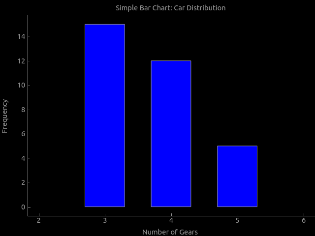

# PYTHON IMPLEMENTATION

## Data Set

## Dependences

* Matplotlib
* Seaborn
* Vispy
* Pyqtgraph

## Code Example

### Matplotlib

~~~~{.python}
import matplotlib.pyplot as plt
from datos import data
import pandas

d=data('mtcars')
ps = pandas.Series([i for i in d.gear])
counts = ps.value_counts()

plt.bar(counts.index,counts,0.35, color="blue")
plt.title('Simple Bar Chart: Car Distribution ', family='serif',
size=16)
plt.xlabel('Number of Gears', family= 'serif')
plt.ylabel('Frequency', family='serif')
plt.show()
~~~~~~~~~~~~~

{width=12 cm}

### Seaborn

~~~~{.python}
import seaborn as sns
import matplotlib.pyplot as plt
from datos import data
import pandas

d=data('mtcars')
ps = pandas.Series([i for i in d.gear])
counts = ps.value_counts()

sns.set(style="white", context="talk")

f, (ax1) = plt.subplots()
sns.barplot(counts.index, counts, palette="BuGn_d")
ax1.set_title("Simple Bar Chart: Car Distribution")
ax1.set_ylabel("Frequency")
ax1.set_xlabel("Number of Gears")
plt.show()
~~~~~~~~~~~~~

{width=12 cm}

### Pyqtgraph

~~~~{.python}
import pyqtgraph as pg
from pyqtgraph.Qt import QtCore, QtGui
from datos import data
import pandas

d=data('mtcars')
ps = pandas.Series([i for i in d.gear])
counts = ps.value_counts()

win = pg.plot(title='Simple Bar Chart')
bg1 = pg.BarGraphItem(x=counts.index, height=counts, width=0.6,
brush='b')
win.addItem(bg1)
win.setTitle('Simple Bar Chart: Car Distribution')
win.setLabel('left', "Frequency", )
win.setLabel('bottom', "Number of Gears")

if __name__ == '__main__':
    import sys
    if (sys.flags.interactive != 1) or not hasattr(QtCore,
'PYQT_VERSION'):
        QtGui.QApplication.instance().exec_()
~~~~~~~~~~~~~
{width=12 cm}

### References
