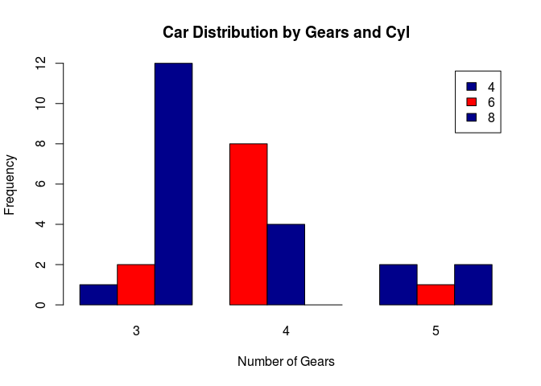
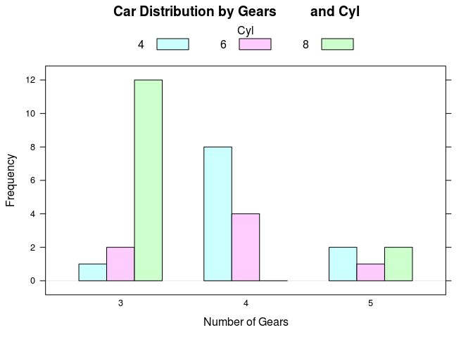
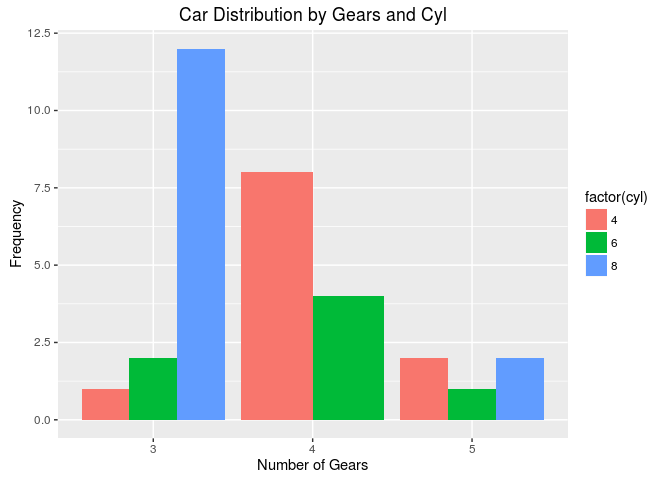

R IMPLEMENTATION
================

R is a language and environment for statistical computing and graphics.
It is a GNU project which is similar to the S language and environment
which was developed at Bell Laboratories (formerly AT&T, now Lucent
Technologies) by John Chambers and colleagues. R provides a wide variety
of statistical (linear and nonlinear modelling, classical statistical
tests, time-series analysis, classification, clustering, …) and
graphical techniques, and is highly extensible (The R Fundation,
2016)[^1].

Data Set
--------

For this proyect it was use the dataset mtcars. This data was extracted
from the 1974 Motor Trend US magazine, and comprises fuel consumption
and 10 aspects of automobile design and performance for 32 automobiles
(1973–74 models).

    counts <- table(mtcars$cyl, mtcars$gear)
    counts

    ##    
    ##      3  4  5
    ##   4  1  8  2
    ##   6  2  4  1
    ##   8 12  0  2

Dependences
-----------

-   **Graphics**. This package contains functions for **base graphics**.
    Base graphics are traditional S-like graphics, as opposed to the
    more recent grid graphics(R Core Team,s.f. )[^2].
-   **Lattice**. Is an implementation of Trellis graphics for R. It is a
    powerful and elegant high-level data visualization system with an
    emphasis on multivariate data. It is designed to meet most typical
    graphics needs with minimal tuning, but can also be easily extended
    to handle most nonstandard requirements (Sarkar, 2011)[^3]
-   **ggplot2**. Is a plotting system for R, based on the grammar of
    graphics, which tries to take the good parts of base and lattice
    graphics and none of the bad parts. It takes care of many of the
    fiddly details that make plotting a hassle (like drawing legends) as
    well as providing a powerful model of graphics that makes it easy to
    produce complex multi-layered graphics(Wickham, 2013)[^4].

Code Example
------------

### Graphics

    counts <- table(mtcars$cyl, mtcars$gear)
    barplot(counts, main="Car Distribution by Gears and Cyl",
        xlab="Number of Gears", ylab="Frequency", col=c("darkblue","red"),
        legend = rownames(counts), beside=TRUE)

For a complete list of functions with individual help pages, use library
(help = "graphics")(R Core Team,s.f. )[^2].

The online documentation is also available at
[docs.Graphics](https://stat.ethz.ch/R-manual/R-devel/library/graphics/html/00Index.html)

### Lattice

    library("lattice")
    counts <- table(mtcars$gear, mtcars$cyl)
    barchart(counts, stack = FALSE, horizontal="false", main="Car Distribution by Gears     and Cyl",     xlab="Number of Gears", ylab="Frequency",
        auto.key = list(space="top", columns=3, title="Cyl", cex.title=1))

The complete online documentation is also available in the form of a
single
[PDF](https://cran.r-project.org/web/packages/lattice/lattice.pdf) file
at CRAN.

From within R, type:

> help(Lattice)

### ggplot2

    library("ggplot2")
    g <- ggplot(mtcars, aes(factor(gear), fill=factor(cyl))) + geom_bar( position = "dodge")
    g + labs(list(title = "Car Distribution by Gears and Cyl", x="Number of Gears", y="Frequency"))

The ggplot2 documentation is available at
[docs.ggplot2.org](http://docs.ggplot2.org/current/)

References
----------

[^1]: The R Fundation. (s.f). R.Consultado el 3 de marzo, 2016 en
<https://www.r-project.org/about.html>.

[^2]: R Core Team. (s.f). The R Graphics Package. Consultado el 3 de
marzo, 2016 en
<https://stat.ethz.ch/R-manual/R-devel/library/graphics/html/graphics-package.html>.

[^3]: Sarkar, Deepayan. (2011). Lattice: trellis graphics for R.
Consultado el 4 de marzo, 2016 en
<http://lattice.r-forge.r-project.org/>

[^4]: Wickham, Hadley. (2013). ggplot2. Consultado el 4 de marzo, 2016 en
<http://ggplot2.org/>

