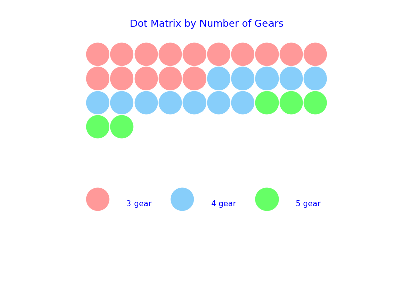

# PYTHON IMPLEMENTATION 

## Data Set

~~~~{.python}
from datos import data
d=data('mtcars')
d.head()
~~~~~~~~~~~~~

## Dependences

* Matplotlib
* Seaborn
* Pyqtgraph
* Pandas

## Code Example

### Matplotlib

~~~~{.python}
import matplotlib.pyplot as plt
import numpy as np

#here's our data to plot, all normal Python lists
x = [1, 2, 3, 4, 5]
y = [0.1, 0.2, 0.3, 0.4, 0.5]
x, y = np.meshgrid(x, y)
fig, ax = plt.subplots(figsize=(2, 2))
#plt.ylim(ymax=0.6)
#plt.xlim(xmax=6)
ax.margins(0.1)
#ax.set_axis_off()
ax.set_xticklabels(" ")
ax.set_yticklabels(" ")
ax.plot(x, y, 'o', markersize=20)
plt.show()
~~~~~~~~~~~~~

{width=12 cm}\

### Seaborn

~~~~{.python}
import seaborn as sns
import numpy as np
import matplotlib.pyplot as plt

x = [1, 2, 3, 4, 5]
y = [0.1, 0.2, 0.3, 0.4, 0.5]
plt.figure(figsize=(2,2))
x, y = np.meshgrid(x, y)
for i in x:
        for j in y:
                sns.swarmplot(x=i,y=j, size=18,palette="Set2")
plt.show()
~~~~~~~~~~~~~

{width=12 cm}\

### Pyqtgraph

~~~~{.python}
import pyqtgraph as pg
from pyqtgraph.Qt import QtCore, QtGui

plotWidget = pg.plot(title="Three plot curves")
plotWidget.resize(800,800)
s3 = pg.ScatterPlotItem(pxMode=False)   ## Set pxMode=False to allow
spots to transform with the view
spots3 = []
for i in range(10):
    for j in range(10):
        spots3.append({'pos': (1e-6*i, 1e-6*j), 'size': 1e-6, 'pen':
{'color': 'w', 'width': 2}, 'brush':pg.intColor(i*10+j, 100)})
s3.addPoints(spots3)
plotWidget.addItem(s3)

if __name__ == '__main__':
    import sys
    if (sys.flags.interactive != 1) or not hasattr(QtCore,
'PYQT_VERSION'):
        QtGui.QApplication.instance().exec_()
~~~~~~~~~~~~~

### References
