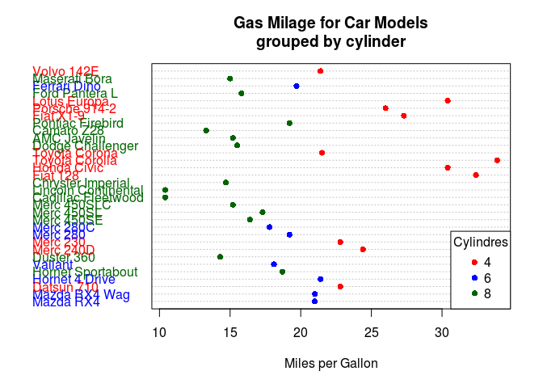
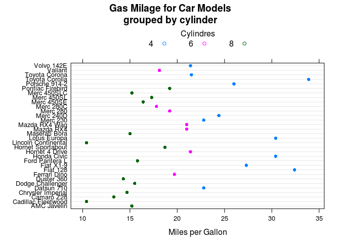

R IMPLEMENTATION
================

Data Set
--------

Dependences
-----------

-   lattice
-   ggplot2

Code Example
------------

### Graphics

    x <- mtcars 
    x$cyl <- factor(x$cyl)
    x$color[x$cyl==4] <- "red"
    x$color[x$cyl==6] <- "blue"
    x$color[x$cyl==8] <- "darkgreen"    
    dotchart(x$mpg,labels=row.names(mtcars),ylim=c(0, 1.00), pch=16,
             main="Gas Milage for Car Models\ngrouped by cylinder",
             xlab="Miles per Gallon", gcolor="black", color=x$color)
    legend("bottomright", legend = c("4", "6", "8"),
           col = c("red","blue","darkgreen"), pch = 16, title="Cylindres")

<!-- -->

### Lattice

    library(lattice)
    dotplot(rownames(mtcars) ~ mpg, data=mtcars, groups=mtcars$cyl, pch=16, main="Gas Milage for Car Models\ngrouped by cylinder",     xlab="Miles per Gallon", auto.key=list(space="top", columns=3, title="Cylindres", cex.title=1))

<!-- -->

### ggplot2

    library(ggplot2)
    g<-ggplot(mtcars, aes(x = mpg, fill = factor(cyl)))
    g+geom_dotplot(stackgroups = TRUE, binwidth = 1.5, binpositions = "all", method="histodot")

<!-- -->

References
----------
