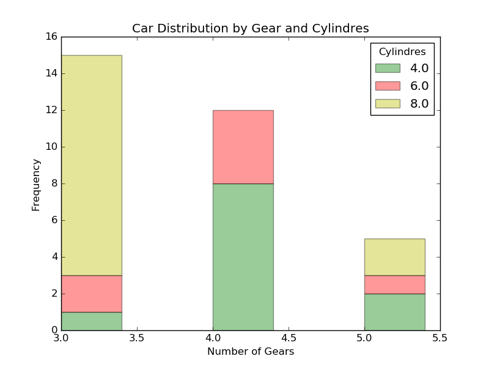

# PYTHON IMPLEMENTATION 

## Data Set

~~~~{.python}
from datos import data
d=data('mtcars')
d.head()
~~~~~~~~~~~~~

## Dependences

* Matplotlib
* Seaborn
* Pyqtgraph
* Pandas

## Code Example

### Matplotlib

~~~~{.python}
import numpy as np
import matplotlib.pyplot as plt
from datos import data
import pandas

d=data('mtcars')
t1 = d.pivot_table( values = 'carb',index=['cyl'], columns = ['gear'],
aggfunc = len)
bar_width = 0.4
opacity = 0.4
rects1 = plt.bar(t1.columns, t1.values[0], bar_width,
alpha=opacity,color='g',)
rects2 = plt.bar(t1.columns, t1.values[1], bar_width, alpha=opacity,
color='r', bottom=t1.values[0])
rects3 = plt.bar(t1.columns, t1.values[2], bar_width, alpha=opacity,
color='y', bottom=t1.values[0]+t1.values[1])
plt.xlabel('Number of Gears')
plt.ylabel('Frequency')
plt.title('Car Distribution by Gear and Cylindres')
plt.legend(t1.index, title='Cylindres')
plt.show()
~~~~~~~~~~~~~

{width=12 cm}

### Seaborn

~~~~{.python}
import seaborn as sns
import matplotlib.pyplot as plt
from datos import data
import pandas

sns.set(style="whitegrid")
f, ax = plt.subplots(figsize=(6, 15))
d=data('mtcars')
t1 = d.pivot_table( values = 'carb',index=['cyl'], columns = ['gear'],
aggfunc = len)
bar_width = 0.4
sns.barplot(x=t1.columns, y=t1.values[0]+t1.values[1]+t1.values[2],
label="8 ", color="#2ecc71")
sns.barplot(x=t1.columns, y=t1.values[0]+t1.values[1],  label="6 ",
color="salmon")
sns.barplot(x=t1.columns, y=t1.values[0],  label="4 ",
color="skyblue")
ax.legend(ncol=1, loc="center right",title="Cylindres")
sns.despine(bottom=True)
plt.title('Car Distribution by Gear and Cylindres', family='Serif',
size=16)
plt.show()
~~~~~~~~~~~~~

{width=12 cm}

### Pyqtgraph

~~~~{.python}
from pyqtgraph.Qt import QtCore, QtGui
import pyqtgraph as pg
import numpy as np
from datos import data
import pandas

d=data('mtcars')
t1 = d.pivot_table( values = 'carb',index=['cyl'], columns = ['gear'],
aggfunc = len)
bar_width = 0.25
win = pg.plot(title='Simple Bar Chart')
bg1 = pg.BarGraphItem(x=t1.columns,
height=t1.values[2]+t1.values[1]+t1.values[0], width=bar_width,
brush='g')
bg2 = pg.BarGraphItem(x=t1.columns, height=t1.values[1]+t1.values[0],
width=bar_width, brush='r')
bg3 = pg.BarGraphItem(x=t1.columns, height=t1.values[0],
width=bar_width, brush='y')
win.addItem(bg1)
win.addItem(bg2)
win.addItem(bg3)
win.setTitle('Car Distribution by Gear and Cylindres ')
win.setLabel('left', "Frequency", )
win.setLabel('bottom', "Number of Gears")

if __name__ == '__main__':
    import sys
    if (sys.flags.interactive != 1) or not hasattr(QtCore,
'PYQT_VERSION'):
        QtGui.QApplication.instance().exec_()
~~~~~~~~~~~~~

{width=12 cm}

### References
