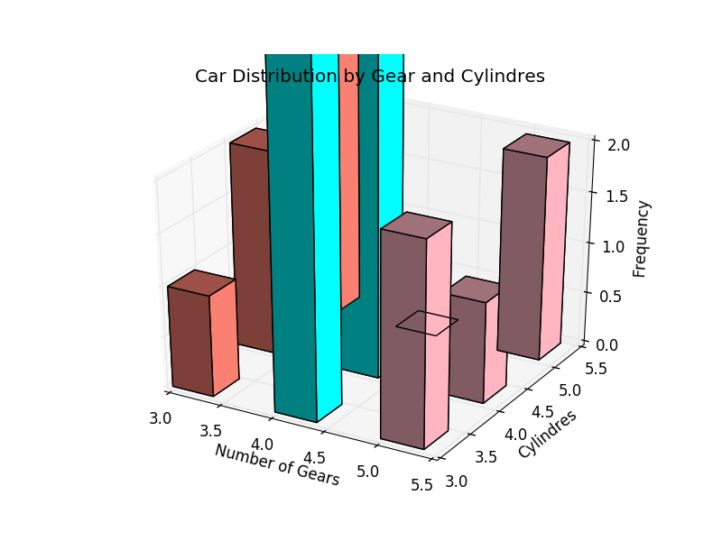

# PYTHON IMPLEMENTATION 

## Data Set

~~~~{.python}
from datos import data
d=data('mtcars')
t1 = d.pivot_table(values = 'carb',index=['cyl'], columns = ['gear'],
aggfunc=len)
~~~~~~~~~~~~~

## Dependences

* Matplotlib
* Seaborn
* Pyqtgraph

## Code Example

### Matplotlib

~~~~{.python}
from mpl_toolkits.mplot3d import Axes3D
import matplotlib.pyplot as plt
import numpy as np
from datos import data

d=data('mtcars')
fig = plt.figure()
ax = fig.add_subplot(111, projection='3d',  xlabel='Number of Gears' ,
ylabel='Cylindres', zlabel='Frequency', title='Car Distribution by
Gear and Cylindres')
t1 = d.pivot_table( values = 'carb',index=['cyl'], columns = ['gear'],
aggfunc = len)
x,y =t1.columns, t1.columns
xpos, ypos = np.meshgrid(x , y )
elements = len(x) * len(y)
xpos = xpos.flatten()
ypos = ypos.flatten()
zpos = np.zeros(elements)
dx = 0.4 * np.ones_like(zpos)
dy = dx.copy()
dz=t1.values.flatten()
c=['salmon','aqua','lightpink',
'salmon','aqua','lightpink','salmon','aqua','lightpink']
ax.bar3d(xpos, ypos, zpos, dx, dy, dz, color=c, zsort='average')
plt.show()
~~~~~~~~~~~~~

{width=12 cm}\

### Seaborn

### Pyqtgraph

~~~~{.python}
from pyqtgraph.Qt import QtCore, QtGui
import pyqtgraph as pg
import numpy as np
from datos import data

if __name__ == '__main__':
    import sys
    if (sys.flags.interactive != 1) or not hasattr(QtCore,
'PYQT_VERSION'):
        QtGui.QApplication.instance().exec_()
~~~~~~~~~~~~~

### References
