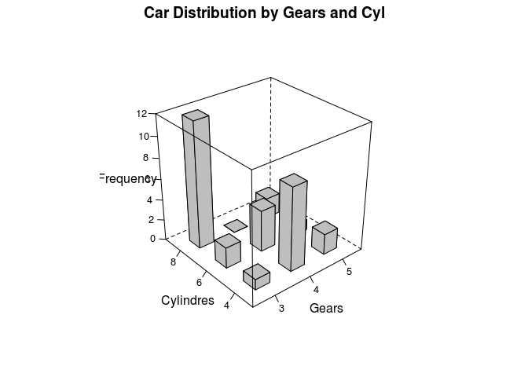

R IMPLEMENTATION
================

R is a language and environment for statistical computing and graphics.
It is a GNU project which is similar to the S language and environment
which was developed at Bell Laboratories (formerly AT&T, now Lucent
Technologies) by John Chambers and colleagues. R provides a wide variety
of statistical (linear and nonlinear modelling, classical statistical
tests, time-series analysis, classification, clustering, …) and
graphical techniques, and is highly extensible (The R Fundation,
2016)[^1].

Data Set
--------

For this proyect it was use the dataset mtcars. This data was extracted
from the 1974 Motor Trend US magazine, and comprises fuel consumption
and 10 aspects of automobile design and performance for 32 automobiles
(1973–74 models).

    counts <- table(mtcars$cyl, mtcars$gear)
    counts

    ##    
    ##      3  4  5
    ##   4  1  8  2
    ##   6  2  4  1
    ##   8 12  0  2

Dependences
-----------

-   **LatticeExtra**. Building on the infrastructure provided by the
    lattice package, this package provides several new high-level
    functions and methods, as well as additional utilities such as panel
    and axis annotation functions. (Sarkar, 2016)[^2]

Code Example
------------

### Lattice

    d <- table(mtcars$gear, mtcars$cyl)
    data<-as.data.frame(d)
    names(data)<-c("Gears","Cylindres","Frequency")
    data$Gears

    ## [1] 3 4 5 3 4 5 3 4 5
    ## Levels: 3 4 5

    library(latticeExtra)

    ## Loading required package: lattice

    ## Loading required package: RColorBrewer

    cloud(Frequency~Gears+Cylindres, data, panel.3d.cloud=panel.3dbars, col.facet='grey', 
          xbase=0.4, ybase=0.4, scales=list(arrows=FALSE, col=1), main="Car Distribution by Gears and Cyl", 
          par.settings = list(axis.line = list(col = "transparent")))

The complete online documentation is also available in the form of a
single
[PDF](https://cran.r-project.org/web/packages/latticeExtra/latticeExtra.pdf)
file at CRAN.

References
----------

[^1]: The R Fundation. (s.f). R.Consultado el 3 de marzo, 2016 en
<https://www.r-project.org/about.html>.

[^2]: Sarkar, Deepayan (2016). R. Consultado el 5 de marzo, 2016 en
<https://cran.r-project.org/web/packages/latticeExtra/latticeExtra.pdf>
