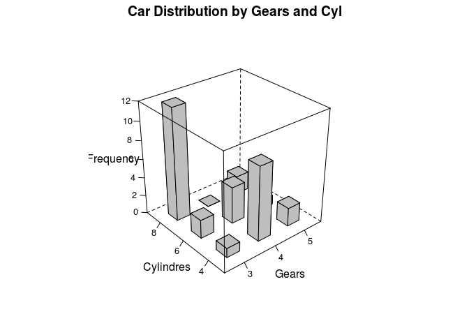

R IMPLEMENTATION
================

Data Set
--------

    counts <- table(mtcars$cyl, mtcars$gear)
    counts

    ##    
    ##      3  4  5
    ##   4  1  8  2
    ##   6  2  4  1
    ##   8 12  0  2

Dependences
-----------

-   lattice
-   latticeExtra
-   ggplot2

Code Example
------------

### Graphics

### Lattice

    d <- table(mtcars$gear, mtcars$cyl)
    data<-as.data.frame(d)
    names(data)<-c("Gears","Cylindres","Frequency")
    data$Gears

    ## [1] 3 4 5 3 4 5 3 4 5
    ## Levels: 3 4 5

    library(latticeExtra)

    ## Loading required package: lattice

    ## Loading required package: RColorBrewer

    cloud(Frequency~Gears+Cylindres, data, panel.3d.cloud=panel.3dbars, col.facet='grey', 
          xbase=0.4, ybase=0.4, scales=list(arrows=FALSE, col=1), main="Car Distribution by Gears and Cyl", 
          par.settings = list(axis.line = list(col = "transparent")))

<!-- -->

### ggplot2

References
----------
