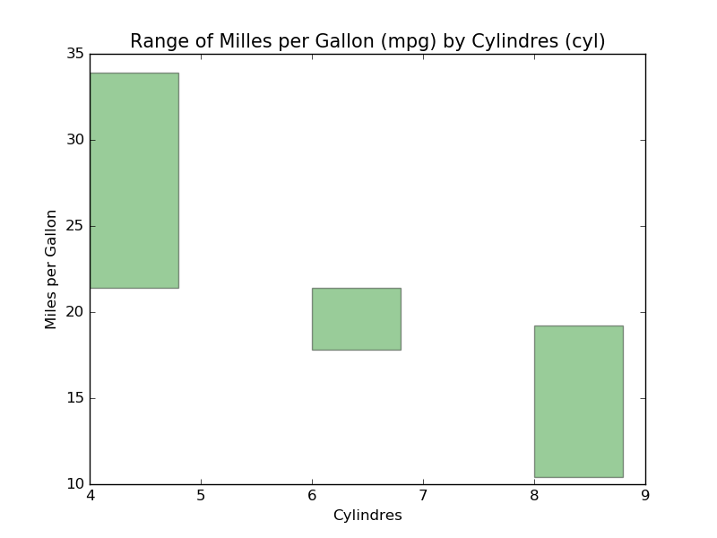

# PYTHON IMPLEMENTATION 

## Data Set

~~~~{.python}
from datos import data
d=data('mtcars')
d.head()
~~~~~~~~~~~~~

## Dependences

* Matplotlib
* Seaborn
* Pyqtgraph
* Pandas

## Code Example

### Matplotlib

~~~~{.python}
import numpy as np
import matplotlib.pyplot as plt
from datos import data
import pandas as pd

d=data('mtcars')
subset1, subset2, subset3= d[d.cyl==4], d[d.cyl==6], d[d.cyl==8]
x=pd.DataFrame ({'Max': [max(subset1.mpg), max(subset2.mpg),
max(subset3.mpg)],
                                 'Min': [min(subset1.mpg),
min(subset2.mpg), min(subset3.mpg)],
                                 'Span':
[max(subset1.mpg)-min(subset1.mpg), max(subset2.mpg)-min(subset2.mpg),
max(subset3.mpg)-min(subset3.mpg)]})
x.index=[4,6,8]
bar_width = 0.8
opacity = 0.4
plt.bar(x.index,x.Span, bar_width, alpha=opacity,color='g',
bottom=x.Min)
plt.xlabel('Cylindres')
plt.ylabel('Miles per Gallon')
plt.title('Range of Milles per Gallon (mpg) by Cylindres (cyl)',
size=15)
plt.show()
~~~~~~~~~~~~~

\

### Seaborn

~~~~{.python}
import seaborn as sns
import matplotlib.pyplot as plt
from datos import data
import pandas as pd

sns.set(style="white")
f, ax = plt.subplots(figsize=(6, 15))
d=data('mtcars')
subset1, subset2, subset3= d[d.cyl==4], d[d.cyl==6], d[d.cyl==8]
datos=pd.DataFrame ({'Max': [max(subset1.mpg), max(subset2.mpg),
max(subset3.mpg)],
                                 'Min': [min(subset1.mpg),
min(subset2.mpg), min(subset3.mpg)],
                                 'Span':
[max(subset1.mpg)-min(subset1.mpg), max(subset2.mpg)-min(subset2.mpg),
max(subset3.mpg)-min(subset3.mpg)]})
datos.index=[4,6,8]
sns.barplot(x=datos.index, y=datos.Max, color="#2ecc71", linewidth=0)
sns.barplot(x=datos.index, y=datos.Min, color="white", linewidth=0)
sns.axlabel('Cylindres','Milles Per Gall')
plt.title('Range of Milles per Gallon (mpg) by Cylindres (cyl)',
family='Serif', size=16)
plt.show()
~~~~~~~~~~~~~

\

### Pyqtgraph

### References
