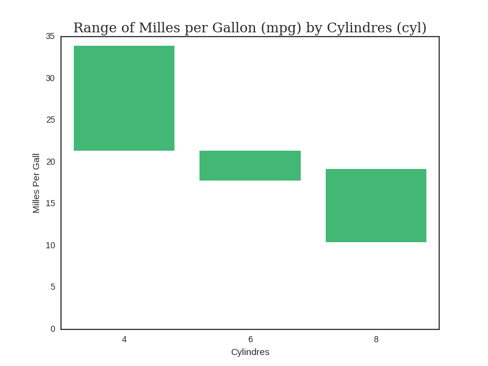
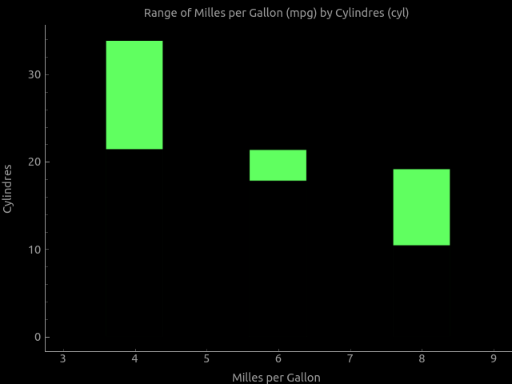

# PYTHON IMPLEMENTATION 

## Data Set

For this example it was used Data Set called mtcars (Motor Trend Car Road Tests), which comes by default in R. This data was extracted from the 1974 Motor Trend US magazine, and comprises fuel consumption and 10 aspects of automobile design and performance for 32 automobiles (1973–74 models). 

To use this data set in Python, was used a Python module called rpy2. First create a file named as datos.py and write the next code.

~~~~{.python}
from rpy2.robjects import r
from rpy2.robjects import pandas2ri

def data(name):
        return pandas2ri.ri2py(r[name])
~~~~~~~~~~~~~

Then it is necessary import the datos.py file into the proyect, which you are working.

~~~~{.python}
from datos import data
d=data('mtcars')
~~~~~~~~~~~~~

## Dependences

* **rpy2** Python interface to the R language (Gautier, 2016)[^1]. The rpy2 package is used to access all R datasets from Python.
* **Matplotlib** is a python 2D plotting library which produces publication quality figures in a variety of hardcopy formats and interactive environments across platforms. matplotlib can be used in python scripts, the python and ipython shell, web application servers, and six graphical user interface toolkits (Hunter, 2016)[^2].
* **Seaborn** is a Python visualization library based on matplotlib. It provides a high-level interface for drawing attractive statistical graphics (Waskom,2013)[^3].
* **Pyqtgraph**  is a pure-python graphics and GUI library built on PyQt4 / PySide and numpy. It is intended for use in mathematics / scientific / engineering applications (Campagnola, 2014)[^4].

## Code Example

### Matplotlib

~~~~{.python}
import numpy as np
import matplotlib.pyplot as plt
from datos import data
import pandas as pd

d=data('mtcars')
subset1, subset2, subset3= d[d.cyl==4], d[d.cyl==6], d[d.cyl==8]
x=pd.DataFrame ({'Max': [max(subset1.mpg), max(subset2.mpg),
max(subset3.mpg)],
                                 'Min': [min(subset1.mpg),
min(subset2.mpg), min(subset3.mpg)],
                                 'Span':
[max(subset1.mpg)-min(subset1.mpg), max(subset2.mpg)-min(subset2.mpg),
max(subset3.mpg)-min(subset3.mpg)]})
x.index=[4,6,8]
bar_width = 0.8
opacity = 0.4
plt.bar(x.index,x.Span, bar_width, alpha=opacity,color='g',
bottom=x.Min)
plt.xlabel('Cylindres')
plt.ylabel('Miles per Gallon')
plt.title('Range of Milles per Gallon (mpg) by Cylindres (cyl)',
size=15)
plt.show()
~~~~~~~~~~~~~

The complete online documentation is also available at [matplotlib](http://matplotlib.org/contents.html).

### Seaborn

~~~~{.python}
import seaborn as sns
import matplotlib.pyplot as plt
from datos import data
import pandas as pd

sns.set(style="white")
f, ax = plt.subplots(figsize=(6, 15))
d=data('mtcars')
subset1, subset2, subset3= d[d.cyl==4], d[d.cyl==6], d[d.cyl==8]
datos=pd.DataFrame ({'Max': [max(subset1.mpg), max(subset2.mpg),
max(subset3.mpg)],
                                 'Min': [min(subset1.mpg),
min(subset2.mpg), min(subset3.mpg)],
                                 'Span':
[max(subset1.mpg)-min(subset1.mpg), max(subset2.mpg)-min(subset2.mpg),
max(subset3.mpg)-min(subset3.mpg)]})
datos.index=[4,6,8]
sns.barplot(x=datos.index, y=datos.Max, color="#2ecc71", linewidth=0)
sns.barplot(x=datos.index, y=datos.Min, color="white", linewidth=0)
sns.axlabel('Cylindres','Milles Per Gall')
plt.title('Range of Milles per Gallon (mpg) by Cylindres (cyl)',
family='Serif', size=16)
plt.show()
~~~~~~~~~~~~~

The online documentation is available in [Seaborn](https://stanford.edu/~mwaskom/software/seaborn/api.html).

### Pyqtgraph

~~~~{.python}
from pyqtgraph.Qt import QtCore, QtGui
import pyqtgraph as pg
from datos import data
import pandas as pd

d=data('mtcars')
subset1, subset2, subset3= d[d.cyl==4], d[d.cyl==6], d[d.cyl==8]
datos=pd.DataFrame ({'Max': [max(subset1.mpg), max(subset2.mpg),
max(subset3.mpg)],
                                 'Min': [min(subset1.mpg),
min(subset2.mpg), min(subset3.mpg)],
                                 'Span':
[max(subset1.mpg)-min(subset1.mpg), max(subset2.mpg)-min(subset2.mpg),
max(subset3.mpg)-min(subset3.mpg)]})
datos.index=[4,6,8]
bar_width = 0.8
win = pg.plot(title='Simple Bar Chart')
bg1 = pg.BarGraphItem(x=datos.index, height=datos.Max,
width=bar_width, brush=(96,255,96), pen='k')
bg2 = pg.BarGraphItem(x=datos.index, height=datos.Min,
width=bar_width, brush='k', pen='k' )
win.addItem(bg1)
win.addItem(bg2)
win.setTitle('Range of Milles per Gallon (mpg) by Cylindres (cyl) ')
win.setLabel('left', "Cylindres", )
win.setLabel('bottom', "Milles per Gallon")

if __name__ == '__main__':
    import sys
    if (sys.flags.interactive != 1) or not hasattr(QtCore,
'PYQT_VERSION'):
        QtGui.QApplication.instance().exec_()
~~~~~~~~~~~~~

The complete online documentation is also available at [Pyqtrgaph](http://www.pyqtgraph.org/documentation/).

### References

[^1]: Gautier, Laurent (2016). rpy2. Consultado el 01 de Febrero, 2016 en http://rpy2.bitbucket.org/
[^2]: Hunter, John (2016). matplotlib. Consultado el 03 de Febrero, 2016 en http://matplotlib.org/
[^3]: Waskom, Michael (2016). Seaborn. Consultado el 08 de Febrero, 2016 en https://stanford.edu/~mwaskom/software/seaborn/index.htmltest/
[^4]: Campagnola, Luke (2014). Pyqtgraph. Consultado el 10 de Febrero, 2016 http://www.pyqtgraph.org/
