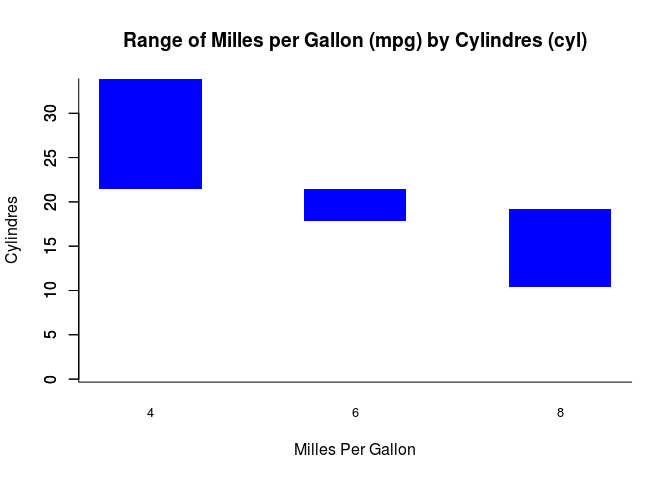
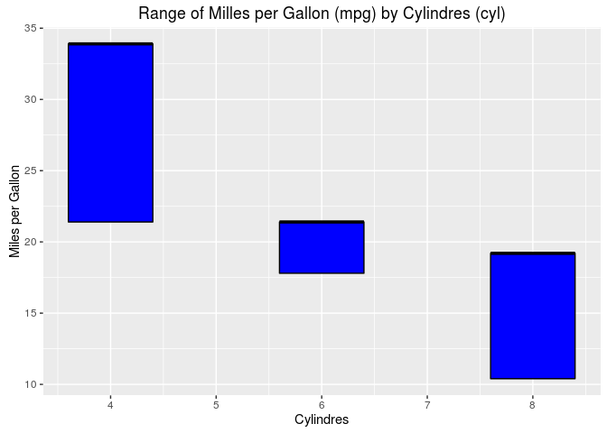

R IMPLEMENTATION
================

Data Set
--------

    head(mtcars)

    ##                    mpg cyl disp  hp drat    wt  qsec vs am gear carb
    ## Mazda RX4         21.0   6  160 110 3.90 2.620 16.46  0  1    4    4
    ## Mazda RX4 Wag     21.0   6  160 110 3.90 2.875 17.02  0  1    4    4
    ## Datsun 710        22.8   4  108  93 3.85 2.320 18.61  1  1    4    1
    ## Hornet 4 Drive    21.4   6  258 110 3.08 3.215 19.44  1  0    3    1
    ## Hornet Sportabout 18.7   8  360 175 3.15 3.440 17.02  0  0    3    2
    ## Valiant           18.1   6  225 105 2.76 3.460 20.22  1  0    3    1

Dependences
-----------

-   lattice
-   ggplot2

Code Example
------------

### Graphics

    ci<-c(4,6,8)
    x<-subset(mtcars, mtcars$cyl==4)
    x<-range(x$mpg)
    y<-subset(mtcars, mtcars$cyl==6)
    y<-range(y$mpg)
    z<-subset(mtcars, mtcars$cyl==8)
    z<-range(z$mpg)
    df<-data.frame(cyl=ci,from=c(x[1],y[1],z[1]), to=c(x[2],y[2],z[2]))
    barplot(df$to, border='transparent', space=1, col='blue')
    barplot(df$from, space=1, add=TRUE, col='white', 
            border='transparent', names.arg=df$cyl, 
            cex.names=0.8, main="Range of Milles per Gallon (mpg) by Cylindres (cyl)", xlab="Milles Per Gallon", ylab="Cylindres")
    box(bty='l')

<!-- -->

### Lattice

### ggplot2

    library("ggplot2")
    ci<-c(4,6,8)
    x<-subset(mtcars, mtcars$cyl==4)
    x<-range(x$mpg)
    y<-subset(mtcars, mtcars$cyl==6)
    y<-range(y$mpg)
    z<-subset(mtcars, mtcars$cyl==8)
    z<-range(z$mpg)
    df<-data.frame(cyl=ci,from=c(x[1],y[1],z[1]), to=c(x[2],y[2],z[2]))
    g <- ggplot(df, aes(cyl,to)) + geom_crossbar(aes(ymin = from, ymax = to), width = 0.8, fill="blue")
    g + labs(list(title = "Range of Milles per Gallon (mpg) by Cylindres (cyl)",  x="Cylindres", y="Miles per Gallon"))

<!-- -->

References
----------
