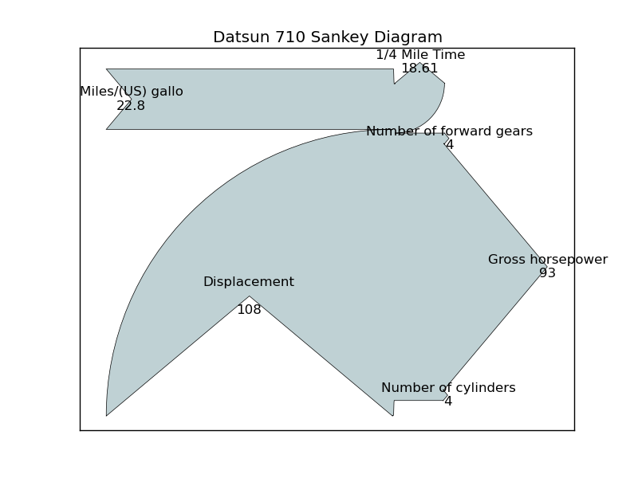

# Python Implementation Pattern

Sankey Diagram is a graphic that contains intputs an ouputs, they represent a sum respectively. In such diagrams, it is easy to see representations of the efforts of input and output.

## Data Set

For this example it will be used Data Set called mtcars, this data set is the R default data set, to use this data set, was used a Python module called rpy2, which is used to use data sets of R in python. This data was extracted from the 1974 Motor Trend US magazine, and comprises fuel consumption and 10 aspects of automobile design and performance for 32 automobiles (1973–74 models).

## Dependencies 

list of Modules that are required for implementation
> Matplotlib

## Code example 

### Code Example With Matplotlib

\

