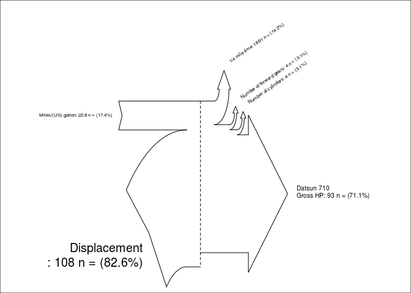
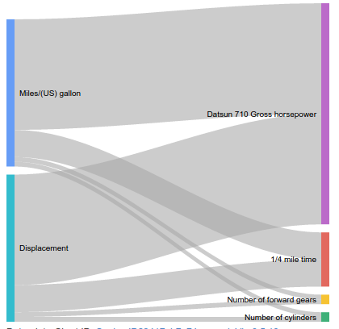

R Implementation Pattern
========================

Sankey Diagram is a graphic that contains intputs an ouputs, they
represent a sum respectively. In such diagrams, it is easy to see
representations of the efforts of input and output.

Data Set
--------

For this example it will be used Data Set called mtcars, this data set
is the R default data set this data was extracted from the 1974 Motor
Trend US magazine, and comprises fuel consumption and 10 aspects of
automobile design and performance for 32 automobiles (1973–74 models).

    head(mtcars)

    ##                    mpg cyl disp  hp drat    wt  qsec vs am gear carb
    ## Mazda RX4         21.0   6  160 110 3.90 2.620 16.46  0  1    4    4
    ## Mazda RX4 Wag     21.0   6  160 110 3.90 2.875 17.02  0  1    4    4
    ## Datsun 710        22.8   4  108  93 3.85 2.320 18.61  1  1    4    1
    ## Hornet 4 Drive    21.4   6  258 110 3.08 3.215 19.44  1  0    3    1
    ## Hornet Sportabout 18.7   8  360 175 3.15 3.440 17.02  0  0    3    2
    ## Valiant           18.1   6  225 105 2.76 3.460 20.22  1  0    3    1

Dependencies
------------

> Graphics - default package on R

For this example in graphics it will be used other dependence called
Sankey.R this dependence is hosted in this link:
\[<https://gist.github.com/aaronberdanier/1423501#file-sankey-r>\]

> GoogleVis

Code example
------------

### Code Example With Graphics

    source('Sankey.R')

    # My example (there is another example inside Sankey.R):
    mpg=mtcars["Datsun 710",1]
    hp=mtcars["Datsun 710",4]
    cyl=mtcars["Datsun 710",2]
    wt= mtcars["Datsun 710",6]
    disp=mtcars["Datsun 710",3]
    qsec=mtcars["Datsun 710",7]
    gear =mtcars["Datsun 710",10]
    inputs = c(mpg,disp)
    losses = c(qsec,gear,cyl,hp)
    unit = "n ="

    labels = c("Miles/(US) gallon",
               "Displacement\n",
               "1/4 mile time",
               "Number of forward gears",
               "Number of cylinders",
               "Datsun 710\nGross horsepower\n")

    SankeyR(inputs,losses,unit,labels)

### Code Example With GoogleVis

In this example, a package called GoogleVis google for R is used, this
package generates Web graphics can also be used in desktop applications.

    require(googleVis)

    ## Loading required package: googleVis

    ## 
    ## Welcome to googleVis version 0.5.10
    ## 
    ## Please read the Google API Terms of Use
    ## before you start using the package:
    ## https://developers.google.com/terms/
    ## 
    ## Note, the plot method of googleVis will by default use
    ## the standard browser to display its output.
    ## 
    ## See the googleVis package vignettes for more details,
    ## or visit http://github.com/mages/googleVis.
    ## 
    ## To suppress this message use:
    ## suppressPackageStartupMessages(library(googleVis))

    mpg=mtcars["Datsun 710",1]
    hp=mtcars["Datsun 710",4]
    cyl=mtcars["Datsun 710",2]
    wt= mtcars["Datsun 710",6]
    disp=mtcars["Datsun 710",3]
    qsec=mtcars["Datsun 710",7]
    gear =mtcars["Datsun 710",10]
    dat <- data.frame(From=c(rep("Miles/(US) gallon",4), rep("Displacement", 4)),
                      To=c(rep(c("1/4 mile time",
                                 "Number of forward gears",
                                 "Number of cylinders",
                                 "Datsun 710 Gross horsepower"))),
                      Weight=c(mpg,gear,0,0,0,0,cyl,hp))

    sk1 <- gvisSankey(dat, from="From", to="To", weight="Weight")
    plot(sk1)

