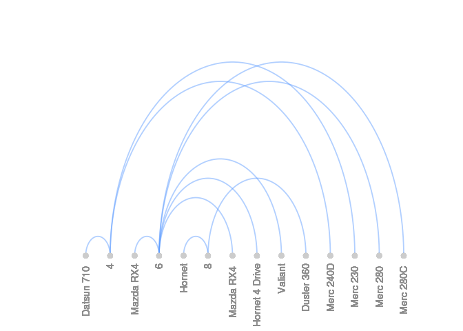

R Implementation Pattern
========================

Therad Arcs is a type of graph showing the relationship between
different elements of a network design that shows nodes on a single
axis.

Data Set
--------

For this example it will be used Data Set called mtcars, this data set
is the R default data set this data was extracted from the 1974 Motor
Trend US magazine, and comprises fuel consumption and 10 aspects of
automobile design and performance for 32 automobiles (1973–74 models).

    head(mtcars)

    ##                    mpg cyl disp  hp drat    wt  qsec vs am gear carb
    ## Mazda RX4         21.0   6  160 110 3.90 2.620 16.46  0  1    4    4
    ## Mazda RX4 Wag     21.0   6  160 110 3.90 2.875 17.02  0  1    4    4
    ## Datsun 710        22.8   4  108  93 3.85 2.320 18.61  1  1    4    1
    ## Hornet 4 Drive    21.4   6  258 110 3.08 3.215 19.44  1  0    3    1
    ## Hornet Sportabout 18.7   8  360 175 3.15 3.440 17.02  0  0    3    2
    ## Valiant           18.1   6  225 105 2.76 3.460 20.22  1  0    3    1

Dependencies
------------

> Arcdiagram

For this example in graphics it will be used other dependence called
arcdiagram the documentation of this dependence is hosted in this link:
\[<http://gastonsanchez.com/software/arcdiagram_introduction.pdf>\]

Code example
------------

### Code Example With Arcdiagram

    library(arcdiagram)

    lab = rbind(c("Datsun 710 ",  mtcars$cyl[3]),c("Mazda RX4", mtcars$cyl[1]),c("Hornet",  mtcars$cyl[5]),
    c("Mazda RX4 ", mtcars$cyl[2]),c("Hornet 4 Drive",  mtcars$cyl[4]),  c("Valiant",  mtcars$cyl[6]), c("Duster 360",
     mtcars$cyl[7]), c("Merc 240D",  mtcars$cyl[8]), c("Merc 230 ",  mtcars$cyl[9]), c("Merc 280 ",  mtcars$cyl[10]),
    c("Merc 280C ",  mtcars$cyl[11]))

    # arc diagram
    arcplot(lab)

<!-- -->
