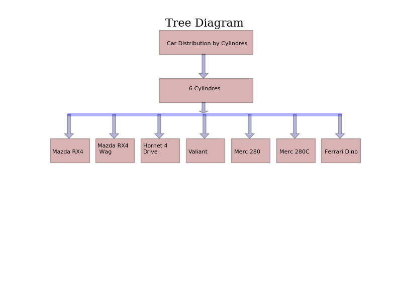

# PYTHON IMPLEMENTATION 

## Data Set

For this proyect it will use the dataset mtcars of R.

The data was extracted from the 1974 Motor Trend US magazine, and comprises fuel consumption and 10 aspects of automobile design and performance for 32 automobiles (1973–74 models)

~~~~{.python}
from datos import data
d=data('mtcars')
~~~~~~~~~~~~~

## Dependences

* **rpy2** Python interface to the R language (Gautier, 2016)[^1].
* **Matplotlib** is a python 2D plotting library which produces publication quality figures in a variety of hardcopy formats and interactive environments across platforms. matplotlib can be used in python scripts, the python and ipython shell, web application servers, and six graphical user interface toolkits (Hunter, 2016)[^2].
* **Graphviz**  *Simple Python interface for Graphviz*.  This package facilitates the creation and rendering of graph descriptions in the DOT language of the Graphviz graph drawing software from Python (Bank, 2016)[^3].

## Code Example

### Matplotlib

~~~~{.python}
import matplotlib.pyplot as plt
import matplotlib
import numpy as np
import matplotlib.patches as mpatches
import matplotlib.lines as mlines
from matplotlib.collections import PatchCollection
from datos import data

fig = plt.figure()
ax = fig.add_subplot(111, frameon=False)
d=data('mtcars')
subset1= d[d.cyl==6]
patches = []
arrow = mpatches.Arrow(0.492,0.9, 0, -0.1, width=0.05)
patches.append(arrow)
rect=mpatches.Rectangle((0.35, 0.9), 0.3, 0.1)
fig.text(0.415,0.85,"Car Distribution by Cylindres", fontsize='8')
patches.append(rect)
arrow = mpatches.Arrow(0.492,0.7, 0.0, -0.045, width=0.05)
patches.append(arrow)
rect=mpatches.Rectangle((0.35, 0.7), 0.3, 0.1)
fig.text(0.47,0.7,"6 Cylindres", fontsize='8')
patches.append(rect)
x=0.0
x1=0.13
y=0.45
y1=0.49
xx=0.06
for i in subset1.index:
    arrow = mpatches.Arrow(xx,0.65, 0.0, -0.1, width=0.05)
    patches.append(arrow)
    if len(i)>12:
        fig.text(x1,y1,i[0:9]+"\n"+i[9:], fontsize='8')
    else:
        fig.text(x1,y1,str(i), fontsize='8')
    rect=mpatches.Rectangle((x, y),0.125, 0.1)
    patches.append(rect)
    x=x+0.145
    x1=x1+0.113
    xx=xx+0.145

x, y = np.array([[0.06, 0.93], [0.65, 0.65]])
line = mlines.Line2D(x , y , lw=5., alpha=0.3)
ax.add_line(line)
colors=[0,1]
p = PatchCollection(patches,  alpha=0.3)
p.set_array(np.array(colors))
ax.add_collection(p)
plt.title('Tree Diagram ', family='serif', size=16)
ax.xaxis.set_visible(False)
ax.yaxis.set_visible(False)
plt.show()
~~~~~~~~~~~~~

The complete online documentation is also available at [matplotlib](http://matplotlib.org/contents.html)

### Graphviz

~~~~{.python}
from graphviz import Digraph
from datos import data

d=data('mtcars')
subset1= d[d.cyl==6]
dot = Digraph(comment='Tree Diagram', format='png')
dot.attr('node', shape='box')
dot.node_attr.update(color='lightblue2', style='filled')
dot.node('A', 'Car Distribution by Cylindres')
dot.node('B', '6 cylindres')
j=67;
for i in subset1.index:
        dot.node(unichr(j), str(i))
        print i+"\n"
        j=j+1

dot.edge('A', 'B')
dot.edges(['BC','BD','BE','BF','BG','BH','BI'])
dot.body.append(r'label = "\n\nTree Diagram"')
dot.body.append('fontsize=20')
dot.render('diagram')
~~~~~~~~~~~~~

The link for Documentation is [Graphviz](http://graphviz.readthedocs.io/en/latest/index.html)

### References

[^1]: Gautier, Laurent (2016). rpy2. Consultado el 09 de Febrero, 2016 en http://rpy2.bitbucket.org/
[^2]: Hunter, John (2016). matplotlib. Consultado el 13 de Febrero, 2016 en http://matplotlib.org/
[^3]: Bank, Sebastian (2016). graphviz. Consultado el 07 de Mayo, 2016 en http://graphviz.readthedocs.io/en/latest/
