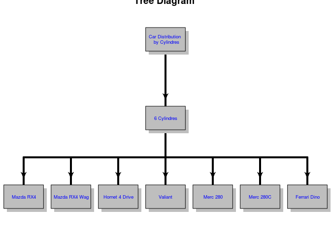

R IMPLEMENTATION
================

For implementation of pattern Tree Diagram in R, it use the package
"diagram". This package include functions for visualises simple graphs
(networks) based on a transition matrix, utilities to plot flow
diagrams, visualising webs, electrical networks, ... (Soetaert,
2014)[^1].

Data Set
--------

For this proyect it was use the dataset mtcars. This data was extracted
from the 1974 Motor Trend US magazine, and comprises fuel consumption
and 10 aspects of automobile design and performance for 32 automobiles
(1973–74 models).

    head(mtcars)

    ##                    mpg cyl disp  hp drat    wt  qsec vs am gear carb
    ## Mazda RX4         21.0   6  160 110 3.90 2.620 16.46  0  1    4    4
    ## Mazda RX4 Wag     21.0   6  160 110 3.90 2.875 17.02  0  1    4    4
    ## Datsun 710        22.8   4  108  93 3.85 2.320 18.61  1  1    4    1
    ## Hornet 4 Drive    21.4   6  258 110 3.08 3.215 19.44  1  0    3    1
    ## Hornet Sportabout 18.7   8  360 175 3.15 3.440 17.02  0  0    3    2
    ## Valiant           18.1   6  225 105 2.76 3.460 20.22  1  0    3    1

Dependences
-----------

-   **Diagram:**

Code Example
------------

### Diagram

    library(diagram)

    ## Loading required package: shape

    par(mfrow=c(1,1))
    par(mar=c(0,0,0,0))
    openplotmat(main="Tree Diagram ")
    x<-subset(mtcars, mtcars$cyl==4)
    y<-subset(mtcars, mtcars$cyl==6)
    z<-subset(mtcars, mtcars$cyl==8)
    elpos<-coordinates (c(1,1,7))
    treearrow(from=elpos[1,],to=elpos[2,],lwd=4)  
    treearrow(from=elpos[2,],to=elpos[3:9,],lwd=4) 
    labs<-c("Car Distribution \n by Cylindres", "6 Cylindres",  row.names(y))
    for ( i in 1:length(labs)) textrect(elpos[i,],radx=0.06,rady=0.05,lab=labs[i] ,cex=0.6, col = "blue", box.col="grey")

<!-- -->
The complete online documentation is also available in the form of a
single
[PDF](https://cran.r-project.org/web/packages/diagram/diagram.pdf) file
at CRAN.

From within R, type:

> help(diagram)

References
----------

[^1] Soetaert, Karline (2014). CRAN. Consultado el 12 de Mayo, 2016 en
<https://cran.r-project.org/web/packages/diagram/index.html>.
