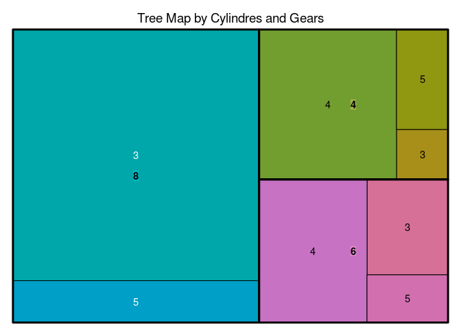

R IMPLEMENTATION
================

For implementation of pattern Tree Map in R, it use the package
"treemap". A treemap is a space-filling visualization of hierarchical
structures. This package offers great flexibility to draw treemaps
(Tennekes, 2016)[^1].

Data Set
--------

For this proyect it will use the dataset mtcars.

The data was extracted from the 1974 Motor Trend US magazine, and
comprises fuel consumption and 10 aspects of automobile design and
performance for 32 automobiles (1973–74 models).

    head(mtcars)

    ##                    mpg cyl disp  hp drat    wt  qsec vs am gear carb
    ## Mazda RX4         21.0   6  160 110 3.90 2.620 16.46  0  1    4    4
    ## Mazda RX4 Wag     21.0   6  160 110 3.90 2.875 17.02  0  1    4    4
    ## Datsun 710        22.8   4  108  93 3.85 2.320 18.61  1  1    4    1
    ## Hornet 4 Drive    21.4   6  258 110 3.08 3.215 19.44  1  0    3    1
    ## Hornet Sportabout 18.7   8  360 175 3.15 3.440 17.02  0  0    3    2
    ## Valiant           18.1   6  225 105 2.76 3.460 20.22  1  0    3    1

Dependences
-----------

-   **Treemap**

Code Example
------------

### Treemap

    library(treemap)
    treemap(mtcars,
    index=c("cyl", "gear"),
    vSize="cyl", title="Tree Map by Cylindres and Gears")

<!-- -->
The complete online documentation is also available in the form of a
single
[PDF](https://cran.r-project.org/web/packages/treemap/treemap.pdf) file
at CRAN.

From within R, type:

> help(treemap)

References
----------

[^1] Tennekes, Martijn (2016). CRAN. Consultado el 16 de Mayo, 2016 en
<https://cran.r-project.org/web/packages/treemap/index.html>
