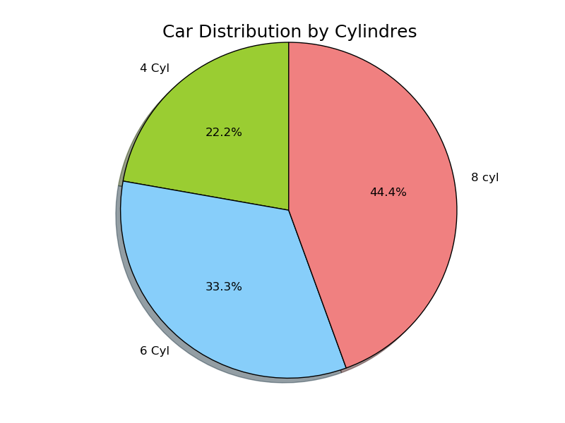

# PYTHON IMPLEMENTATION 

## Data Set

~~~~{.python}
from datos import data
d=data('mtcars')
t1 = d.pivot_table( values = 'carb',index=['cyl'], columns = ['gear'],
aggfunc =len)
~~~~~~~~~~~~~

## Dependences

* Matplotlib
* Seaborn
* Pyqtgraph
* Pandas

## Code Example

### Matplotlib

~~~~{.python}
import matplotlib.pyplot as plt
import numpy as np
from datos import data

labels = '4 Cyl', '6 Cyl', '8 cyl'
colors = ['yellowgreen', 'lightskyblue', 'lightcoral']
d=data('mtcars')
t1 = d.pivot_table( values = 'carb',index=['cyl'], columns = ['gear'],
aggfunc = len)
plt.pie(t1.index,  labels=labels, colors=colors,
        autopct='%1.1f%%', shadow=True, startangle=90)
plt.axis('equal')
plt.title('Car Distribution by Cylindres', size=18)
plt.show()
~~~~~~~~~~~~~

\

### Seaborn

### Pyqtgraph

### References
