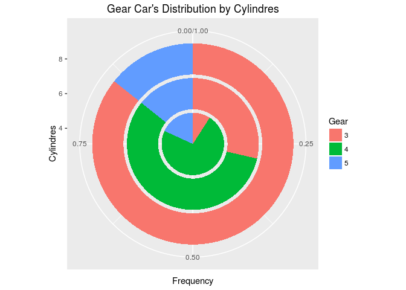

R IMPLEMENTATION
================

Data Set
--------

    table(mtcars$cyl)

    ## 
    ##  4  6  8 
    ## 11  7 14

Dependences
-----------

-   lattice
-   ggplot2

Code Example
------------

### Graphics

### Lattice

### ggplot2

    library(ggplot2)
    ggplot(mtcars, aes(x = gear, y = carb, fill = factor(carb))) + 
      geom_bar(width = 0.85, stat="identity") +    
      coord_polar(theta = "y") 

<!-- -->

References
----------
