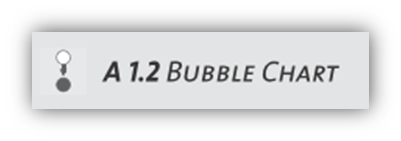

`# A 1.1: SCATTERPLOT

## Description

A scatterplot displays correlations between two metric variables. It visually describes a two-column table with pairs of variates that doesn’t provide much meaningful information in the tabular form, especially when the underlying datasets become large. In a scatterplot chart, each pair of variates is represented by a dot in a two- dimensional Cartesian coordinate system. With a sufficient number of elements, it enables the viewer to identify certain development trends of the data and potentially even points to functiona correlations between the observed variables. Also, exceptions from such functional rules become visible, like outliers (Behrens, 2008).

## Required Data

Use a scatterplot to display a dataset that consist of a list of pairs of variates. Both attributes of such pairs (i.e. both observed variables) represent quantitative values. The usual written form for this kind of data is a two-column table with each column representing one variable and each row containing the values of one individual pair of variates. A typical example for this kind of data are quantitative results extracted from experiments or studies (Behrens, 2008).

## Usage

Create a two-dimensional Cartesian coordinate system. Label and subdivide the axes according to the variables they represent. For each pair of variates from your data tabl , draw a point at the corresponding coordinates. The result of this process is a cloud of dots scattered over the coordinate space.
In certain cases it is possible that identical pairs of variates occur more than once. This means that several dots in the scatterplot would overlap each other, distorting the expressiveness of the graphic. There are several methods to circumvent this problem  with the two most popular ones being the sunflower and the jittered scatterplot technique.
In the first case, attach a short stroke to each dot in the plot every time a duplicate occurs. This way the user will be able to count multiple overlapping dots.
The second method, known as jittered scatterplot, adds a random value to each pair of variate, so that elements with identical attributes will slightly deviate from their actual coordinate position and move out of the shadow of overlapping elements.
The random value must be large enough to make the deviation of a dot detectable for the user’s eye.
However, it should be kept as small as possible so that it doesn’t jeopardize chart’s accuracy. In any case you will buy the readability of the graphic at the price of a slightly less precise display (Behrens, 2008).

## Rationale

In short: A picture says more than a thousand table rows. While human perception is not suitable at all to browse and process long tables of numbers in order to derive meaning from them, visual patterns and their corresponding exceptions become clear within an instance. That’s why scatterplots are a simple but useful tool to display relationships, detect trends and make developments visible that lie hidden within your data. Although a quite simplistic display type, the scatterplot can give you great insight into these data with very little effort (Behrens, 2008).

## Related Patterns

