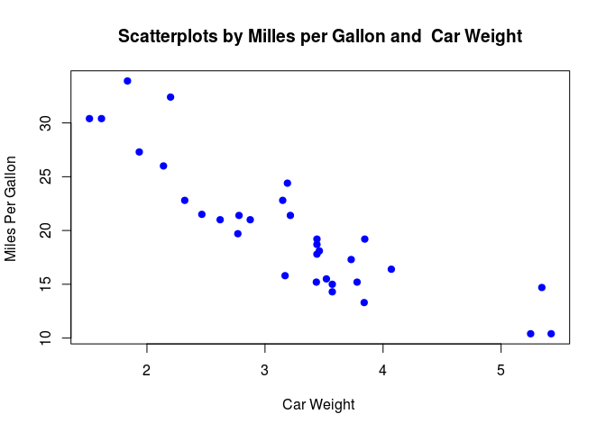
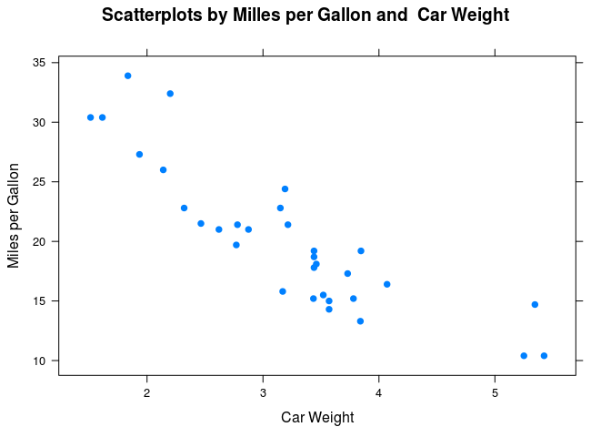
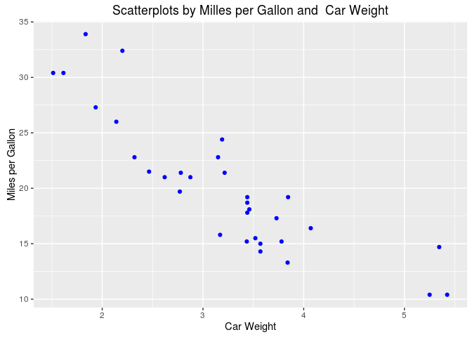

R IMPLEMENTATION
================

R is a language and environment for statistical computing and graphics.
It is a GNU project which is similar to the S language and environment
which was developed at Bell Laboratories (formerly AT&T, now Lucent
Technologies) by John Chambers and colleagues. R provides a wide variety
of statistical (linear and nonlinear modelling, classical statistical
tests, time-series analysis, classification, clustering, …) and
graphical techniques, and is highly extensible (The R Fundation,
2016)[^1].

Data Set
--------

For this proyect it was use the dataset mtcars. This data was extracted
from the 1974 Motor Trend US magazine, and comprises fuel consumption
and 10 aspects of automobile design and performance for 32 automobiles
(1973–74 models).

    head(mtcars)

    ##                    mpg cyl disp  hp drat    wt  qsec vs am gear carb
    ## Mazda RX4         21.0   6  160 110 3.90 2.620 16.46  0  1    4    4
    ## Mazda RX4 Wag     21.0   6  160 110 3.90 2.875 17.02  0  1    4    4
    ## Datsun 710        22.8   4  108  93 3.85 2.320 18.61  1  1    4    1
    ## Hornet 4 Drive    21.4   6  258 110 3.08 3.215 19.44  1  0    3    1
    ## Hornet Sportabout 18.7   8  360 175 3.15 3.440 17.02  0  0    3    2
    ## Valiant           18.1   6  225 105 2.76 3.460 20.22  1  0    3    1

Dependences
-----------

-   **Graphics**. This package contains functions for **base graphics**.
    Base graphics are traditional S-like graphics, as opposed to the
    more recent grid graphics(R Core Team,s.f. )[^2].
-   **Lattice**. Is an implementation of Trellis graphics for R. It is a
    powerful and elegant high-level data visualization system with an
    emphasis on multivariate data. It is designed to meet most typical
    graphics needs with minimal tuning, but can also be easily extended
    to handle most nonstandard requirements (Sarkar, 2011)[^3]
-   **ggplot2**. Is a plotting system for R, based on the grammar of
    graphics, which tries to take the good parts of base and lattice
    graphics and none of the bad parts. It takes care of many of the
    fiddly details that make plotting a hassle (like drawing legends) as
    well as providing a powerful model of graphics that makes it easy to
    produce complex multi-layered graphics(Wickham, 2013)[^4].

Code Example
------------

### Graphics

Plot is generic function for plotting of R objects and draw a scatter
plot with decorations such as axes and titles in the active graphics
window.

    plot(mtcars$wt, mtcars$mpg, 
         main="Scatterplots by Milles per Gallon and  Car Weight",  
         xlab="Car Weight ", ylab="Miles Per Gallon ", pch=19, col="blue")

For a complete list of functions with individual help pages, use library
(help = "graphics")(R Core Team,s.f. )[5].

The online documentation is also available at
[docs.Graphics](https://stat.ethz.ch/R-manual/R-devel/library/graphics/html/00Index.html)

### Lattice

Lattice function xyplot produces bivariate scatterplots.

    library(lattice)
    xyplot(mtcars$mpg~mtcars$wt, 
        main="Scatterplots by Milles per Gallon and  Car Weight", 
        xlab="Car Weight", ylab="Miles per Gallon", pch=19)

The complete online documentation is also available in the form of a
single
[PDF](https://cran.r-project.org/web/packages/lattice/lattice.pdf) file
at CRAN. From within R, type:

> help(Lattice)

### ggplot2

The point geom is used to create scatterplots in ggplot2.

    library(ggplot2)
    g <- ggplot(mtcars, aes(wt, mpg))+geom_point(colour="blue")
    g + labs(list(title = "Scatterplots by Milles per Gallon and  Car Weight",  x="Car Weight", y="Miles per Gallon"))

The ggplot2 documentation is available at
[docs.ggplot2.org](http://docs.ggplot2.org/current/)

References
----------

[^1]: The R Fundation. (s.f). R.Consultado el 3 de marzo, 2016 en
<https://www.r-project.org/about.html>.

[^2]: R Core Team. (s.f). The R Graphics Package. Consultado el 3 de
marzo, 2016 en
<https://stat.ethz.ch/R-manual/R-devel/library/graphics/html/graphics-package.html>.

[^3]: Sarkar, Deepayan. (2011). Lattice: trellis graphics for R.
Consultado el 4 de marzo, 2016 en
<http://lattice.r-forge.r-project.org/>

[^4]: Wickham, Hadley. (2013). ggplot2. Consultado el 4 de marzo, 2016 en
<http://ggplot2.org/>
