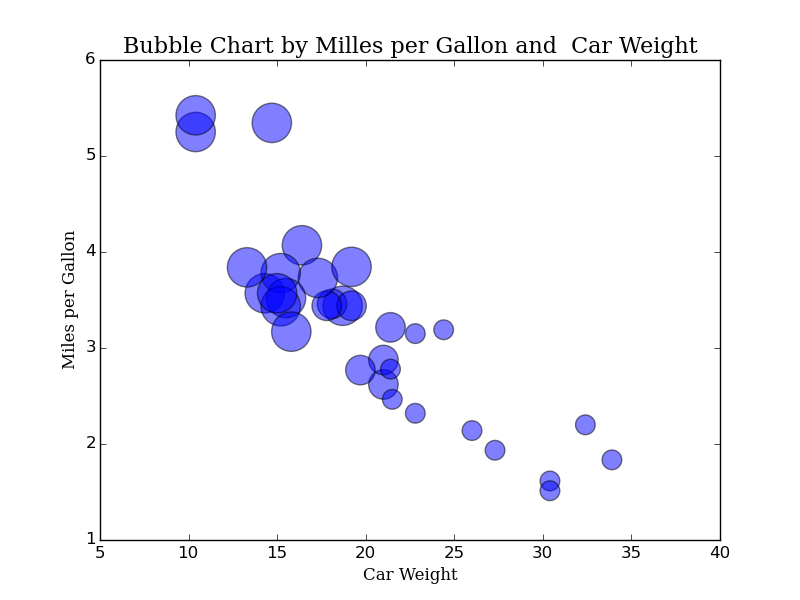
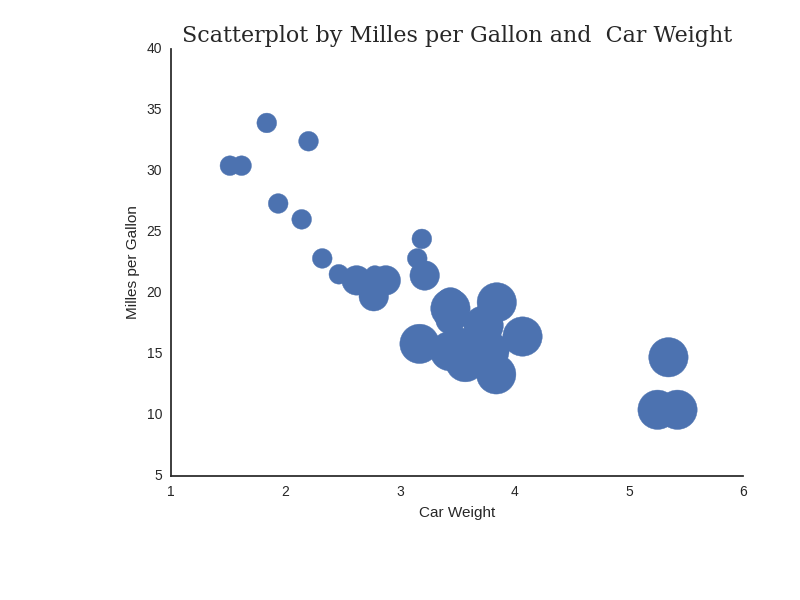
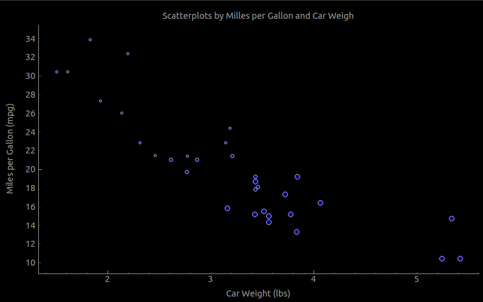

# PYTHON IMPLEMENTATION

## Data Set

We use the data set mtcars R.
Create a file named as datos.py and write the next code.

~~~~{.python}
from rpy2.robjects import r
from rpy2.robjects import pandas2ri

def data(name):
        return pandas2ri.ri2py(r[name])
~~~~~~~~~~~~~

Then you need import the data.py file into a proyect.

~~~~{.python}
from datos import data
d=data('mtcars')
d
~~~~~~~~~~~~~

## Dependences

* rpy2:  The rpy2 package is used to access all R datasets from Python.
* Matplotlib: 
* Seaborn: 
* Pyqtgraph: 

## Code Example

### Matplotlib

~~~~{.python}
import numpy as np
import matplotlib.pyplot as plt
from datos import data

d=data('mtcars')
area = np.pi * (2 * d.cyl)**2  # 0 to 15 point radiuses
plt.scatter(d.mpg, d.wt, s=area, c='blue', alpha=0.5)
plt.title('Bubble Chart by Milles per Gallon and  Car Weight',
family='serif', size=16)
plt.xlabel('Car Weight', family= 'serif')
plt.ylabel('Miles per Gallon', family='serif')
plt.show()
~~~~~~~~~~~~~

{width=12 cm}

### Seaborn

~~~~{.python}
import numpy as np
import matplotlib.pyplot as plt
import seaborn as sns
from datos import data

d=data('mtcars')
sns.set(style="white")
g = sns.FacetGrid(d)
area = np.pi * (2 * d.cyl)**2
g.map(plt.scatter, "wt", "mpg",s=area)
plt.title("Scatterplot by Milles per Gallon and  Car Weight",
family='serif', size=16)
g.set_axis_labels("Car Weight","Milles per Gallon")
plt.show()
~~~~~~~~~~~~~

{width=12 cm}

### Pyqtgraph

~~~~{.python}
import pyqtgraph as pg
from pyqtgraph.Qt import QtCore, QtGui
import numpy as np
from datos import data

d=data('mtcars')
win = pg.GraphicsWindow()
win.resize(800,500)
win.setWindowTitle('Bubble Chart')
plt= win.addPlot(title="Scatterplots by Milles per Gallon and  Car
Weigh")
plt.plot(d.wt,d.mpg, pen=None, symbol='o', symbolSize=d.cyl,
symbolPen=(255,255,255,200), symbolBrush=(0,0,255,150))
plt.setLabel('left', "Miles per Gallon", units='mpg')
plt.setLabel('bottom', "Car Weight", units='lbs')

if __name__ == '__main__':
    import sys
    if (sys.flags.interactive != 1) or not hasattr(QtCore,
'PYQT_VERSION'):
        QtGui.QApplication.instance().exec_()
~~~~~~~~~~~~~
{width=12 cm}

## References
