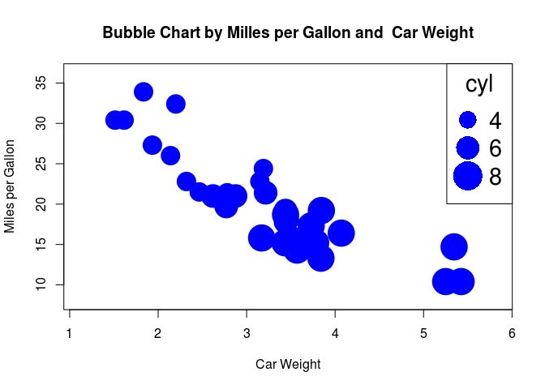
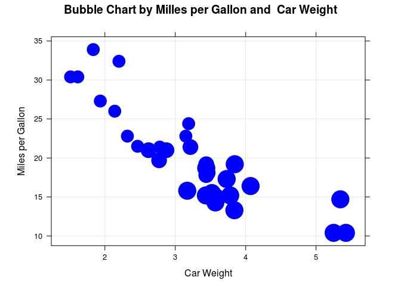
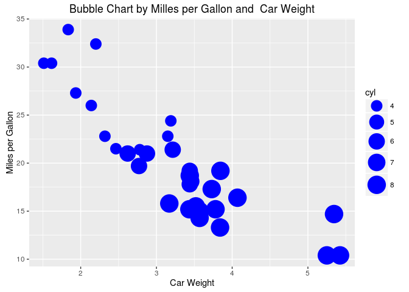

R IMPLEMENTATION
================

Data Set
--------

    head(mtcars)

    ##                    mpg cyl disp  hp drat    wt  qsec vs am gear carb
    ## Mazda RX4         21.0   6  160 110 3.90 2.620 16.46  0  1    4    4
    ## Mazda RX4 Wag     21.0   6  160 110 3.90 2.875 17.02  0  1    4    4
    ## Datsun 710        22.8   4  108  93 3.85 2.320 18.61  1  1    4    1
    ## Hornet 4 Drive    21.4   6  258 110 3.08 3.215 19.44  1  0    3    1
    ## Hornet Sportabout 18.7   8  360 175 3.15 3.440 17.02  0  0    3    2
    ## Valiant           18.1   6  225 105 2.76 3.460 20.22  1  0    3    1

Dependences
-----------

-   Lattice
-   ggplot2

Code Example
------------

### Graphics

    radius <- sqrt( mtcars$cyl/ pi )
    symbols(mtcars$wt,mtcars$mpg, circles=radius,inches=0.17, fg="blue", bg="blue", xlab="Car Weight", ylab="Miles per Gallon", main="Bubble Chart by Milles per Gallon and  Car Weight")
    legend("topright", legend=c(4,6,8), col="blue",title = "cyl", pch=16, cex= 1.8, pt.cex=3:5)

<!-- -->

### Lattice

    library(lattice)
    xyplot(mtcars$mpg~mtcars$wt, aspect = 2/3,
           grid = TRUE,
           cex = sqrt( mtcars$cyl/ pi )*2.3, fill.color = rep("blue",40), 
           col = "blue",main="Bubble Chart by Milles per Gallon and  Car Weight", 
           xlab="Car Weight", ylab="Miles per Gallon",
           panel = function(x, y, ..., cex, fill.color, subscripts) {
             panel.xyplot(x, y, cex = cex[subscripts],
                          pch = 21, fill = fill.color[subscripts], ...)
           })

<!-- -->

### ggplot2

    library (ggplot2)
    g <- ggplot(mtcars, aes(wt, mpg, size = cyl))+geom_point(colour="blue") + scale_size_continuous(range=c(6,10))
    g + labs(list(title = "Bubble Chart by Milles per Gallon and  Car Weight",  x="Car Weight", y="Miles per Gallon"))

<!-- -->

References
----------
