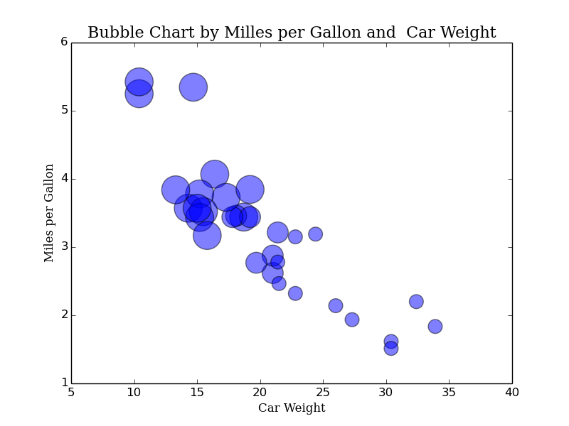

# PYTHON IMPLEMENTATION

## Data Set

## Dependences

* rpy2:  The rpy2 package is used to access all R datasets from Python.
* Matplotlib
* Seaborn
* Vispy
* Pyqtgraph

## Code Example

### Matplotlib

{width=12 cm}\

### Seaborn

### Vispy

### Pyqtgraph

## References
